# SQLC-Wizard Quality Improvements Execution Plan

**Date:** 2025-11-06 15:32
**Focus:** Type Safety, Tests, Architecture Quality

---

## 🎯 PARETO ANALYSIS: 1% → 4% → 20% → 100%

### 1% THAT DELIVERS 51% VALUE (Highest ROI)

| Task                          | Time  | Impact | Why Critical                                                       |
| ----------------------------- | ----- | ------ | ------------------------------------------------------------------ |
| Fix interface{} → PathOrPaths | 60min | 🔥🔥🔥 | Foundational type safety - prevents entire class of runtime errors |

### 4% THAT DELIVERS 64% VALUE (Critical Quality)

| Task                                 | Time  | Impact | Why Critical              |
| ------------------------------------ | ----- | ------ | ------------------------- |
| Fix interface{}                      | 60min | 🔥🔥🔥 | (from 1%)                 |
| Bootstrap Ginkgo test infrastructure | 30min | 🔥🔥🔥 | Enables all other testing |
| Fix SafetyRules split brain          | 45min | 🔥🔥   | Most critical duplication |

**Total:** 2.25 hours for 64% value

### 20% THAT DELIVERS 80% VALUE (Essential Foundation)

| Task                              | Time  | Impact | Why Critical                |
| --------------------------------- | ----- | ------ | --------------------------- |
| (Above 4 tasks)                   | 2.25h | 🔥🔥🔥 | Foundation                  |
| Fix Features split brain          | 45min | 🔥🔥   | Second critical duplication |
| Add config package tests          | 90min | 🔥🔥🔥 | Most important package      |
| Implement error package structure | 60min | 🔥🔥   | Better error handling       |
| Add smart constructors            | 60min | 🔥🔥   | Type safety at construction |
| Add template package tests        | 60min | 🔥🔥   | Domain logic tests          |
| Remove unused deps (samber/do)    | 15min | 🔥     | Clean codebase              |

**Total:** ~8 hours for 80% value

---

## 📋 COMPREHENSIVE PLAN (30-100min tasks)

| #                                                 | Task                                                 | Time  | Impact | Value | Priority | Blocks |
| ------------------------------------------------- | ---------------------------------------------------- | ----- | ------ | ----- | -------- | ------ |
| **PHASE 1: Type Safety (1% - 51% value)**         |
| 1                                                 | Create PathOrPaths type with UnmarshalYAML           | 30min | 🔥🔥🔥 | 25%   | P0       | -      |
| 2                                                 | Update SQLConfig to use PathOrPaths                  | 15min | 🔥🔥🔥 | 13%   | P0       | 1      |
| 3                                                 | Update template generators for PathOrPaths           | 15min | 🔥🔥🔥 | 13%   | P0       | 2      |
| **PHASE 2: Test Infrastructure (4% - 64% value)** |
| 4                                                 | Bootstrap Ginkgo suites (config, templates, wizard)  | 30min | 🔥🔥🔥 | 8%    | P0       | -      |
| **PHASE 3: Fix Split Brains (4% + 20%)**          |
| 5                                                 | Create domain package for shared types               | 15min | 🔥🔥   | 3%    | P0       | -      |
| 6                                                 | Consolidate SafetyRules → single source of truth     | 30min | 🔥🔥   | 5%    | P0       | 5      |
| 7                                                 | Consolidate Features → EmitOptions                   | 30min | 🔥🔥   | 3%    | P0       | 5      |
| 8                                                 | Update microservice template to use conversions      | 15min | 🔥🔥   | 2%    | P0       | 6,7    |
| **PHASE 4: Error Handling (20%)**                 |
| 9                                                 | Create error package with ErrorCode enum             | 30min | 🔥🔥   | 3%    | P1       | -      |
| 10                                                | Implement WizardError, ConfigError types             | 30min | 🔥🔥   | 2%    | P1       | 9      |
| **PHASE 5: Smart Constructors (20%)**             |
| 11                                                | Add NewProjectType with validation                   | 30min | 🔥🔥   | 2%    | P1       | -      |
| 12                                                | Add NewDatabaseType with validation                  | 30min | 🔥🔥   | 2%    | P1       | -      |
| 13                                                | Update wizard to use constructors                    | 15min | 🔥🔥   | 1%    | P1       | 11,12  |
| **PHASE 6: Config Package Tests (20%)**           |
| 14                                                | Add PathOrPaths tests (string, []string, round-trip) | 30min | 🔥🔥🔥 | 3%    | P1       | 3,4    |
| 15                                                | Add parser tests (valid, invalid, edge cases)        | 45min | 🔥🔥🔥 | 3%    | P1       | 4      |
| 16                                                | Add validator tests (all rules, errors, warnings)    | 45min | 🔥🔥🔥 | 3%    | P1       | 4      |
| 17                                                | Add marshaller tests (round-trip, formatting)        | 30min | 🔥🔥   | 2%    | P1       | 4      |
| **PHASE 7: Template Package Tests (20%)**         |
| 18                                                | Add microservice template tests (all 3 databases)    | 45min | 🔥🔥   | 2%    | P1       | 4,8    |
| 19                                                | Add registry tests                                   | 30min | 🔥🔥   | 1%    | P1       | 4      |
| 20                                                | Add type conversion tests                            | 30min | 🔥🔥   | 1%    | P1       | 4,6,7  |
| **PHASE 8: Cleanup (20%)**                        |
| 21                                                | Remove samber/do dependency                          | 15min | 🔥     | 0.5%  | P1       | -      |
| 22                                                | Run go mod tidy                                      | 5min  | 🔥     | 0.5%  | P1       | 21     |
| **PHASE 9: Verification**                         |
| 23                                                | Run all tests and verify coverage                    | 15min | 🔥🔥🔥 | 3%    | P1       | all    |
| 24                                                | Fix any linter warnings                              | 30min | 🔥     | 1%    | P2       | -      |
| 25                                                | Verify no interface{} remains                        | 15min | 🔥🔥   | 1%    | P1       | 3      |
| 26                                                | Verify no split brains remain                        | 15min | 🔥🔥   | 1%    | P1       | 8      |
| 27                                                | Update documentation                                 | 30min | 🔥     | 1%    | P2       | all    |

**Total:** 27 tasks, ~10.5 hours

**Value Delivered:**

- After Task 3: 51% value (type safety)
- After Task 8: 64% value (+ split brains)
- After Task 22: 80% value (+ tests + errors)
- After Task 27: 100% value (complete)

---

## 🔬 MICRO-TASKS (15min each)

### PHASE 1: Type Safety (Tasks 1-9, ~2 hours)

| #   | Task                                                          | Time  | Pri | Depends |
| --- | ------------------------------------------------------------- | ----- | --- | ------- |
| 1   | Create pkg/config/path_or_paths.go file                       | 5min  | P0  | -       |
| 2   | Define PathOrPaths struct with internal []string              | 5min  | P0  | 1       |
| 3   | Implement UnmarshalYAML (handle string input)                 | 10min | P0  | 2       |
| 4   | Implement UnmarshalYAML (handle []string input)               | 10min | P0  | 3       |
| 5   | Implement MarshalYAML (output []string)                       | 10min | P0  | 2       |
| 6   | Add Strings() []string getter method                          | 5min  | P0  | 2       |
| 7   | Update SQLConfig.Queries to PathOrPaths type                  | 5min  | P0  | 6       |
| 8   | Update SQLConfig.Schema to PathOrPaths type                   | 5min  | P0  | 6       |
| 9   | Update microservice template Queries field                    | 10min | P0  | 7,8     |
| 10  | Update microservice template Schema field                     | 10min | P0  | 7,8     |
| 11  | Update generator to read PathOrPaths.Strings()                | 10min | P0  | 9,10    |
| 12  | Commit: "fix: replace interface{} with type-safe PathOrPaths" | 5min  | P0  | 11      |

### PHASE 2: Test Infrastructure (Tasks 13-16, ~30min)

| #   | Task                                                 | Time  | Pri | Depends |
| --- | ---------------------------------------------------- | ----- | --- | ------- |
| 13  | Run ginkgo bootstrap in pkg/config/                  | 5min  | P0  | -       |
| 14  | Run ginkgo bootstrap in internal/templates/          | 5min  | P0  | -       |
| 15  | Run ginkgo bootstrap in internal/wizard/             | 5min  | P0  | -       |
| 16  | Create test helpers in pkg/config/testdata/          | 15min | P0  | 13      |
| 17  | Commit: "test: bootstrap Ginkgo test infrastructure" | 5min  | P0  | 15,16   |

### PHASE 3: Split Brain Fixes (Tasks 18-30, ~2 hours)

| #   | Task                                                | Time  | Pri | Depends |
| --- | --------------------------------------------------- | ----- | --- | ------- |
| 18  | Create internal/domain/ package                     | 5min  | P0  | -       |
| 19  | Create internal/domain/rule.go with RuleConfig type | 10min | P0  | 18      |
| 20  | Move SafetyRules to domain package                  | 10min | P0  | 19      |
| 21  | Add SafetyRules.ToRuleConfigs() method              | 15min | P0  | 20      |
| 22  | Add unit tests for ToRuleConfigs()                  | 15min | P0  | 21      |
| 23  | Update microservice template to use ToRuleConfigs() | 10min | P0  | 21      |
| 24  | Remove duplicate rule creation code                 | 10min | P0  | 23      |
| 25  | Commit: "fix: consolidate SafetyRules split brain"  | 5min  | P0  | 24      |
| 26  | Create internal/domain/emit_options.go              | 10min | P0  | 18      |
| 27  | Define EmitOptions with all emit flags              | 10min | P0  | 26      |
| 28  | Add EmitOptions.ToGoGenConfig() method              | 15min | P0  | 27      |
| 29  | Update TemplateData to use EmitOptions              | 10min | P0  | 28      |
| 30  | Update wizard to set EmitOptions                    | 10min | P0  | 29      |
| 31  | Update microservice template conversion             | 10min | P0  | 28,29   |
| 32  | Remove Features struct entirely                     | 10min | P0  | 31      |
| 33  | Add unit tests for EmitOptions conversion           | 15min | P0  | 28      |
| 34  | Commit: "fix: consolidate Features split brain"     | 5min  | P0  | 33      |

### PHASE 4: Error Package (Tasks 35-44, ~1.5 hours)

| #   | Task                                              | Time  | Pri | Depends |
| --- | ------------------------------------------------- | ----- | --- | ------- |
| 35  | Create internal/errors/errors.go                  | 5min  | P1  | -       |
| 36  | Define ErrorCode enum (CONFIG_INVALID, etc.)      | 10min | P1  | 35      |
| 37  | Create BaseError struct with Code, Message, Cause | 15min | P1  | 36      |
| 38  | Implement Error() method                          | 5min  | P1  | 37      |
| 39  | Implement Unwrap() method                         | 5min  | P1  | 37      |
| 40  | Create WizardError type                           | 10min | P1  | 37      |
| 41  | Create ConfigError type with field path           | 15min | P1  | 37      |
| 42  | Create TemplateError type                         | 10min | P1  | 37      |
| 43  | Add error formatting helpers                      | 15min | P1  | 38      |
| 44  | Commit: "feat: implement error package structure" | 5min  | P1  | 43      |

### PHASE 5: Smart Constructors (Tasks 45-54, ~1.5 hours)

| #   | Task                                                   | Time  | Pri | Depends |
| --- | ------------------------------------------------------ | ----- | --- | ------- |
| 45  | Change ProjectType to struct with private field        | 10min | P1  | -       |
| 46  | Add ProjectType.String() method                        | 5min  | P1  | 45      |
| 47  | Add NewProjectType(string) (ProjectType, error)        | 15min | P1  | 45      |
| 48  | Add validation for valid project types                 | 10min | P1  | 47      |
| 49  | Add unit tests for NewProjectType                      | 15min | P1  | 47      |
| 50  | Change DatabaseType to struct with private field       | 10min | P1  | -       |
| 51  | Add DatabaseType.String() method                       | 5min  | P1  | 50      |
| 52  | Add NewDatabaseType(string) (DatabaseType, error)      | 15min | P1  | 50      |
| 53  | Update wizard to use constructors                      | 15min | P1  | 47,52   |
| 54  | Commit: "feat: add smart constructors with validation" | 5min  | P1  | 53      |

### PHASE 6: Config Tests (Tasks 55-74, ~2.5 hours)

| #   | Task                                                   | Time  | Pri | Depends |
| --- | ------------------------------------------------------ | ----- | --- | ------- |
| 55  | Create path_or_paths_test.go                           | 5min  | P1  | 13      |
| 56  | Test PathOrPaths with single string                    | 10min | P1  | 55      |
| 57  | Test PathOrPaths with []string                         | 10min | P1  | 55      |
| 58  | Test PathOrPaths round-trip marshaling                 | 15min | P1  | 55      |
| 59  | Test PathOrPaths edge cases (empty, nil)               | 10min | P1  | 55      |
| 60  | Create parser_test.go                                  | 5min  | P1  | 13      |
| 61  | Test Parse with valid minimal config                   | 15min | P1  | 60      |
| 62  | Test Parse with valid full config                      | 15min | P1  | 60      |
| 63  | Test Parse with invalid YAML                           | 10min | P1  | 60      |
| 64  | Test Parse with missing required fields                | 15min | P1  | 60      |
| 65  | Create validator_test.go                               | 5min  | P1  | 13      |
| 66  | Test Validate with valid config                        | 10min | P1  | 65      |
| 67  | Test Validate with missing version                     | 10min | P1  | 65      |
| 68  | Test Validate with invalid engine                      | 10min | P1  | 65      |
| 69  | Test Validate best practice warnings                   | 15min | P1  | 65      |
| 70  | Create marshaller_test.go                              | 5min  | P1  | 13      |
| 71  | Test Marshal basic config                              | 10min | P1  | 70      |
| 72  | Test WriteFileFormatted                                | 15min | P1  | 70      |
| 73  | Test round-trip (parse → marshal → parse)              | 15min | P1  | 70      |
| 74  | Commit: "test: add comprehensive config package tests" | 5min  | P1  | 73      |

### PHASE 7: Template Tests (Tasks 75-89, ~2 hours)

| #   | Task                                        | Time  | Pri | Depends |
| --- | ------------------------------------------- | ----- | --- | ------- |
| 75  | Create microservice_test.go                 | 5min  | P1  | 14      |
| 76  | Test Generate with PostgreSQL               | 15min | P1  | 75      |
| 77  | Test Generate with MySQL                    | 15min | P1  | 75      |
| 78  | Test Generate with SQLite                   | 15min | P1  | 75      |
| 79  | Test UUID overrides for PostgreSQL          | 10min | P1  | 75      |
| 80  | Test JSON overrides                         | 10min | P1  | 75      |
| 81  | Test safety rules generation                | 15min | P1  | 75      |
| 82  | Test rename rules                           | 10min | P1  | 75      |
| 83  | Create registry_test.go                     | 5min  | P1  | 14      |
| 84  | Test Registry.Get existing template         | 10min | P1  | 83      |
| 85  | Test Registry.Get non-existent template     | 10min | P1  | 83      |
| 86  | Test Registry.List                          | 10min | P1  | 83      |
| 87  | Create types_test.go for domain conversions | 5min  | P1  | 14      |
| 88  | Test SafetyRules.ToRuleConfigs()            | 15min | P1  | 87      |
| 89  | Test EmitOptions.ToGoGenConfig()            | 15min | P1  | 87      |
| 90  | Commit: "test: add template package tests"  | 5min  | P1  | 89      |

### PHASE 8: Cleanup (Tasks 91-94, ~20min)

| #   | Task                                                | Time | Pri | Depends |
| --- | --------------------------------------------------- | ---- | --- | ------- |
| 91  | Remove samber/do from go.mod                        | 5min | P1  | -       |
| 92  | Run go mod tidy                                     | 5min | P1  | 91      |
| 93  | Verify no imports of samber/do remain               | 5min | P1  | 92      |
| 94  | Commit: "chore: remove unused samber/do dependency" | 5min | P1  | 93      |

### PHASE 9: Verification (Tasks 95-105, ~1 hour)

| #   | Task                                                            | Time  | Pri | Depends |
| --- | --------------------------------------------------------------- | ----- | --- | ------- |
| 95  | Run go test ./...                                               | 5min  | P1  | all     |
| 96  | Check test coverage: go test -cover ./...                       | 5min  | P1  | 95      |
| 97  | Verify coverage ≥ 60%                                           | 5min  | P1  | 96      |
| 98  | Run go build ./...                                              | 5min  | P1  | -       |
| 99  | Verify no interface{} in pkg/config: grep -r "interface{}"      | 5min  | P1  | 12      |
| 100 | Verify no split brains: check duplication                       | 10min | P1  | 34      |
| 101 | Run go vet ./...                                                | 5min  | P1  | -       |
| 102 | Run go fmt ./...                                                | 5min  | P1  | -       |
| 103 | Update TODO_NEXT_SESSION.md with progress                       | 10min | P2  | all     |
| 104 | Update ARCHITECTURE.md if needed                                | 10min | P2  | all     |
| 105 | Commit: "docs: update documentation after quality improvements" | 5min  | P2  | 104     |

**Total:** 105 micro-tasks, ~12 hours

---

## 📊 EXECUTION GRAPH

```mermaid
graph TD
    Start([Start]) --> Phase1[PHASE 1: Type Safety]
    Phase1 --> T1[Create PathOrPaths]
    T1 --> T2[Update SQLConfig]
    T2 --> T3[Update Templates]
    T3 --> C1[Commit: Type Safety]

    C1 --> Phase2[PHASE 2: Test Infrastructure]
    Phase2 --> T4[Bootstrap Ginkgo]
    T4 --> C2[Commit: Test Infra]

    C2 --> Phase3[PHASE 3: Split Brain Fixes]
    Phase3 --> T5[Create domain package]
    T5 --> T6[Fix SafetyRules]
    T6 --> C3[Commit: SafetyRules]
    C3 --> T7[Fix Features]
    T7 --> C4[Commit: Features]

    C4 --> Phase4[PHASE 4: Error Package]
    Phase4 --> T8[Create error types]
    T8 --> C5[Commit: Errors]

    C5 --> Phase5[PHASE 5: Smart Constructors]
    Phase5 --> T9[Add NewProjectType]
    T9 --> T10[Add NewDatabaseType]
    T10 --> C6[Commit: Constructors]

    C6 --> Phase6[PHASE 6: Config Tests]
    Phase6 --> T11[PathOrPaths tests]
    T11 --> T12[Parser tests]
    T12 --> T13[Validator tests]
    T13 --> T14[Marshaller tests]
    T14 --> C7[Commit: Config Tests]

    C7 --> Phase7[PHASE 7: Template Tests]
    Phase7 --> T15[Microservice tests]
    T15 --> T16[Registry tests]
    T16 --> T17[Domain tests]
    T17 --> C8[Commit: Template Tests]

    C8 --> Phase8[PHASE 8: Cleanup]
    Phase8 --> T18[Remove samber/do]
    T18 --> C9[Commit: Cleanup]

    C9 --> Phase9[PHASE 9: Verification]
    Phase9 --> T19[Run tests]
    T19 --> T20[Verify coverage]
    T20 --> T21[Check quality]
    T21 --> C10[Commit: Docs]

    C10 --> Done([Done: 80% Value])

    style Start fill:#90EE90
    style Done fill:#90EE90
    style Phase1 fill:#FFD700
    style Phase2 fill:#FFD700
    style Phase3 fill:#FFD700
    style Phase6 fill:#87CEEB
    style Phase7 fill:#87CEEB
    style C1 fill:#FFA500
    style C2 fill:#FFA500
    style C3 fill:#FFA500
    style C4 fill:#FFA500
    style C5 fill:#FFA500
    style C6 fill:#FFA500
    style C7 fill:#FFA500
    style C8 fill:#FFA500
    style C9 fill:#FFA500
    style C10 fill:#FFA500
```

---

## 🎯 VALUE DELIVERY CHECKPOINTS

| Checkpoint     | Tasks Complete | Value | What's Achieved                                |
| -------------- | -------------- | ----- | ---------------------------------------------- |
| After Task 12  | 1-12           | 51%   | ✅ Type safety fixed - no more interface{}     |
| After Task 34  | 1-34           | 64%   | ✅ Split brains fixed - single source of truth |
| After Task 54  | 1-54           | 70%   | ✅ Smart constructors - validated at creation  |
| After Task 90  | 1-90           | 80%   | ✅ Tests added - quality assured               |
| After Task 105 | 1-105          | 100%  | ✅ Complete - production ready                 |

---

## 🚀 EXECUTION NOTES

**Order of Execution:**

1. **Type Safety FIRST** - Foundational fix
2. **Test Infrastructure** - Enables testing
3. **Split Brains** - Architecture cleanup
4. **Tests** - Quality assurance
5. **Verification** - Ensure quality

**Commit Strategy:**

- Small, focused commits
- One logical change per commit
- Detailed commit messages

**Testing Strategy:**

- BDD with Ginkgo
- Table-driven tests for variants
- Test each component in isolation

**Success Criteria:**

- ✅ Zero interface{} in pkg/config
- ✅ Zero split brains
- ✅ 60%+ test coverage
- ✅ All tests passing
- ✅ No linter warnings

---

**READY TO EXECUTE!** 🚀
