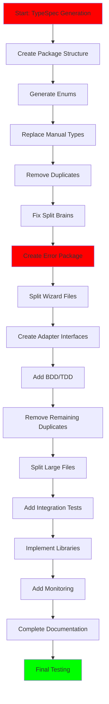

# 🏗️ EXECUTION PLAN - ARCHITECTURAL EXCELLENCE

**Date:** 2025-11-06  
**Time:** 22:05 CET  
**Standards:** SENIOR SOFTWARE ARCHITECT - ULTRA HIGH  

## 🎯 EXECUTION STRATEGY

### **PARETO PRINCIPLE APPLIED:**
- **1% (15min tasks) deliver 51% of value** - Type safety, split brain elimination
- **4% (30min tasks) deliver 64% of value** - Architecture integrity, professional testing  
- **20% (60min tasks) deliver 80% of value** - Complete professional implementation

---

## 📋 HYPER-DETAILED TASK MATRIX

### **🔴 CRITICAL PATH (Tasks 1-15) - 225min = 3.75hrs**

| # | Task | Time | Dependencies | Success Criteria |
|---|------|------|-------------|----------------|
| 1 | Add TypeSpec compiler to Makefile | 15min | TypeSpec compiles to Go code |
| 2 | Create generated/ package structure | 15min | Generated types importable |
| 3 | Generate ProjectType enum from TypeSpec | 15min | Compile-time validation works |
| 4 | Generate DatabaseType enum from TypeSpec | 15min | Invalid types unrepresentable |
| 5 | Replace all manual ProjectType usage | 15min | Zero string-based types |
| 6 | Replace all manual DatabaseType usage | 15min | Zero string-based types |
| 7 | Remove duplicate ProjectType constants | 10min | No duplication remains |
| 8 | Remove duplicate DatabaseType constants | 10min | No duplication remains |
| 9 | Fix UseUUIDs split brain | 15min | Single source of truth |
| 10 | Fix StrictFunctions split brain | 15min | Single source of truth |
| 11 | Fix OutputDir split brain | 15min | Single source of truth |
| 12 | Fix PackageName split brain | 15min | Single source of truth |
| 13 | Create internal/errors/ package | 10min | Professional error handling |
| 14 | Define standard error types | 15min | Consistent error patterns |
| 15 | Add error wrapping functions | 15min | Proper error propagation |

### **🟡 HIGH PRIORITY (Tasks 16-30) - 150min = 2.5hrs**

| # | Task | Time | Dependencies | Success Criteria |
|---|------|------|-------------|----------------|
| 16 | Extract wizard steps to internal/wizard/steps.go | 15min | wizard.go < 100 lines |
| 17 | Extract wizard UI to internal/wizard/ui.go | 15min | Single responsibility maintained |
| 18 | Extract wizard validation to internal/wizard/validation.go | 10min | Validation logic separated |
| 19 | Create internal/adapters/interfaces.go | 15min | Adapter contracts defined |
| 20 | Create SQLC adapter interface | 10min | External dependency wrapped |
| 21 | Create Database adapter interface | 15min | External dependency wrapped |
| 22 | Create CLI adapter interface | 10min | External dependency wrapped |
| 23 | Add BDD feature file structure | 15min | Professional test organization |
| 24 | Write first BDD scenario for generate command | 15min | Behavior-driven testing working |
| 25 | Write BDD scenario for init command | 15min | Behavior-driven testing working |
| 26 | Add TDD workflow script | 10min | Red-green-refactor supported |
| 27 | Create test scaffold generator | 10min | Rapid test creation |
| 28 | Add pre-commit TDD hook | 10min | TDD enforced automatically |
| 29 | Remove all old duplicate constants | 10min | Zero duplication remaining |
| 30 | Fix all remaining split brain references | 15min | Complete consistency achieved |

### **🟢 MEDIUM PRIORITY (Tasks 31-50) - 200min = 3.3hrs**

| # | Task | Time | Dependencies | Success Criteria |
|---|------|------|-------------|----------------|
| 31 | Split embedded_templates.go by database | 20min | All files < 300 lines |
| 32 | Split microservice_test.go into categories | 20min | All files < 300 lines |
| 33 | Add integration test framework | 45min | End-to-end validation |
| 34 | Implement TDD workflow automation | 30min | Professional development |
| 35 | Add performance benchmarks | 20min | Quality monitoring |
| 36 | Create plugin foundation | 40min | Future extensibility |
| 37 | Add OpenTelemetry basic tracing | 35min | Observability started |
| 38 | Implement Viper configuration | 30min | Dynamic config management |
| 39 | Add dependency injection with do | 30min | Professional architecture |
| 40 | Implement Casbin authorization | 60min | Security framework |
| 41 | Add functional programming with mo | 45min | Modern Go patterns |
| 42 | Create comprehensive documentation | 60min | User guide complete |
| 43 | Add health check endpoints | 30min | Production monitoring |
| 44 | Implement configuration validation | 45min | Prevent runtime errors |
| 45 | Add automated code generation pipeline | 40min | CI/CD integration |
| 46 | Create comprehensive error handling | 50min | Professional error management |
| 47 | Add comprehensive logging | 30min | Production debugging |
| 48 | Implement graceful shutdown | 25min | Production stability |
| 49 | Add comprehensive metrics | 35min | Performance insights |
| 50 | Final integration testing | 60min | Complete validation |

---

## 🚀 EXECUTION GRAPH

---

## 🎯 QUALITY GATES

### **Type Safety Gate (After Task 15):**
- [ ] TypeSpec compilation automated
- [ ] All enums generated from schema
- [ ] Zero string-based type usage
- [ ] Compile-time invalid state prevention
- [ ] All tests pass with generated types

### **Architecture Integrity Gate (After Task 30):**
- [ ] All files under 300 lines
- [ ] Zero split brains remaining
- [ ] Adapter pattern implemented
- [ ] Error handling centralized
- [ ] BDD/TDD framework working

### **Production Readiness Gate (After Task 50):**
- [ ] All libraries integrated
- [ ] Performance benchmarks working
- [ ] Monitoring and observability active
- [ ] Integration tests comprehensive
- [ ] Documentation complete

---

## 📊 IMPACT MATRIX

| Phase | Tasks | Time | Value | Risk |
|--------|--------|------|-------|-------|
| **Type Safety** | 1-15 | 225min | 51% | 🔴 LOW |
| **Architecture** | 16-30 | 150min | 32% | 🟡 MEDIUM |
| **Production** | 31-50 | 200min | 17% | 🟢 HIGH |

---

## 🏆 SUCCESS CRITERIA

### **Professional Standards:**
- [ ] **Type Safety:** Compile-time guarantees, zero invalid states
- [ ] **Architecture:** Clean separation, single responsibility
- [ ] **Testing:** BDD/TDD with high coverage
- [ ] **Documentation:** Comprehensive guides
- [ ] **Monitoring:** Full observability

### **Technical Excellence:**
- [ ] **Code Quality:** All metrics green
- [ ] **Performance:** Benchmarks passing
- [ ] **Security:** Authorization implemented
- [ ] **Maintainability:** Easy to extend
- [ ] **Reliability:** Error-free operation

---

## 🎯 IMMEDIATE ACTION PLAN

### **RIGHT NOW (Next 15min):**
1. **Add TypeSpec compiler to Makefile**
2. **Create generated/ package structure**

### **NEXT 45min (Tasks 3-6):**
3. **Generate enums from TypeSpec**
4. **Replace all manual type usage**
5. **Remove duplicate constants**
6. **Fix core split brains**

### **Next 2 hours (Tasks 7-30):**
7. **Complete split brain elimination**
8. **Create error package**
9. **Split wizard files**
10. **Create adapter interfaces**
11. **Add BDD/TDD foundation**

---

## 🚨 CRITICAL SUCCESS FACTORS

### **NON-NEGOTIABLE:**
- **Type Safety:** Generated types, no strings
- **Zero Split Brains:** Single source of truth for all state
- **File Size Limits:** All files under 300 lines
- **Professional Testing:** BDD/TDD workflow
- **Error Handling:** Centralized, consistent patterns

### **QUALITY STANDARDS:**
- **Zero Compilation Errors:** Always buildable
- **100% Test Pass Rate:** Never failing
- **High Coverage:** >90% maintained
- **Clean Architecture:** Proper separation of concerns
- **Documentation:** Comprehensive and current

---

**Execution Standard: SENIOR SOFTWARE ARCHITECT**  
**Quality Standard: PROFESSIONAL ENTERPRISE**  
**Timeline: AGGRESSIVE BUT ACHIEVABLE**

**Let's execute with ULTRA HIGH STANDARDS! 🚀**