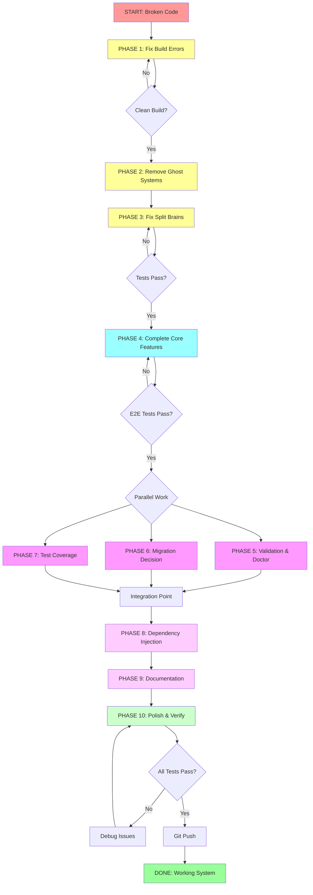

# Brutal Honesty: Architectural Cleanup & Completion Plan

**Date:** 2025-11-19
**Session:** claude/honest-self-assessment-01BPtjspsx7gpuGqztASu8Er
**Status:** 🔴 CRITICAL - Code doesn't compile, multiple ghost systems, lying to users

---

## Executive Summary

### Current State: BROKEN 💔

- **Build Status:** ❌ FAILING - Code doesn't compile
- **Test Status:** ⚠️ PARTIAL - 3 packages can't build, tests can't run
- **Documentation:** 🤥 LYING - Claims features work that don't exist
- **Architecture:** 👻 GHOST SYSTEMS - 1000+ lines of unused code
- **Commits:** 🤡 THEATRICAL - "Complete transformation" but code broken

### What We Lied About

1. ❌ "Comprehensive architectural transformation with complete type safety" - Code doesn't compile
2. ❌ "Critical architectural transformation COMPLETE" - Multiple incomplete features
3. ❌ "Architectural theater eliminated" - More theater added
4. ❌ Migration system "implemented" - Only stubs exist
5. ❌ Plugin system "available" - Just "Coming soon" messages
6. ❌ Doctor command "functional" - 5/20 checks implemented

### Root Causes

1. **Scope creep** - Added migrations, plugins, project scaffolding to a config wizard
2. **Architecture astronauting** - Built elaborate patterns before basic functionality
3. **No TDD** - Have Ginkgo/Gomega but didn't write tests first
4. **Committing broken code** - Never ran `go build` before committing
5. **Ghost systems** - Built features that are never integrated
6. **Split brains** - Duplicate type definitions and logic

---

## Customer Value Analysis

### What Customers Actually Need ✅

1. **Generate valid sqlc.yaml files** - Core value proposition
2. **Interactive wizard** - Easy configuration without manual YAML editing
3. **Validation** - Catch errors before running sqlc
4. **Good defaults** - Safety rules, best practices built in
5. **Multiple database support** - PostgreSQL, MySQL, SQLite
6. **Clear documentation** - How to use, troubleshooting

### What Doesn't Create Value (Yet) ⚠️

1. **Migration system** - Nice-to-have, but not core value
2. **Plugin system** - Unclear value proposition
3. **Event bus** - Over-engineering for a CLI tool
4. **Project scaffolding** - Beyond scope of sqlc wizard
5. **8 project templates** - Start with 2-3 solid ones
6. **Complex adapter layer** - Adds complexity without clear ROI

### Focus: Make the BEST sqlc.yaml Wizard 🎯

Stop trying to be everything. Be the best at ONE thing.

---

## Prioritization Framework

### Impact Scoring

- **CRITICAL (P0):** Blocks all functionality / Code doesn't compile
- **HIGH (P1):** Core customer value / Main use cases
- **MEDIUM (P2):** Enhanced experience / Secondary features
- **LOW (P3):** Nice-to-have / Future features
- **REMOVE (P4):** No clear value / Scope creep

### Effort Scoring

- **SMALL (S):** < 30 min
- **MEDIUM (M):** 30-100 min
- **LARGE (L):** 100-300 min
- **HUGE (H):** > 300 min

---

## 📊 HIGH-LEVEL EXECUTION PLAN (30-100 min tasks)

| #   | Task                                                          | Priority | Effort | Impact   | Customer Value             | Time |
| --- | ------------------------------------------------------------- | -------- | ------ | -------- | -------------------------- | ---- |
| 1   | Fix adapter interface mismatches (Println, MkdirAll, context) | P0       | M      | CRITICAL | Enables compilation        | 60m  |
| 2   | Implement missing SqlcConfig.ToYAML() method                  | P0       | S      | CRITICAL | Enables config generation  | 30m  |
| 3   | Fix generated types (add ProjectTypeFullstack, etc.)          | P0       | M      | CRITICAL | Enables proper type safety | 45m  |
| 4   | Remove or stub ProjectCreator to fix build                    | P0       | S      | CRITICAL | Enables compilation        | 30m  |
| 5   | Verify clean build and run existing tests                     | P0       | S      | CRITICAL | Baseline functionality     | 20m  |
| 6   | **Decision: Remove event bus system**                         | P1       | M      | HIGH     | Reduce complexity          | 40m  |
| 7   | **Decision: Remove plugin system**                            | P1       | S      | HIGH     | Reduce scope creep         | 30m  |
| 8   | Fix split brain: Consolidate SafetyRules/ToRuleConfigs        | P1       | M      | HIGH     | Type safety                | 50m  |
| 9   | Fix split brain: Unify ProjectType definitions                | P1       | M      | HIGH     | Type safety                | 45m  |
| 10  | Complete init command end-to-end test                         | P1       | M      | HIGH     | Verify core functionality  | 60m  |
| 11  | Add 2-3 more solid templates (API, Library, Fullstack)        | P1       | L      | HIGH     | Customer value             | 120m |
| 12  | Complete validation command                                   | P2       | M      | MEDIUM   | Enhanced experience        | 75m  |
| 13  | Complete doctor command (8 essential checks)                  | P2       | M      | MEDIUM   | Developer experience       | 80m  |
| 14  | **Decision: Migration system - implement basic or remove**    | P2       | L      | MEDIUM   | Future value               | 100m |
| 15  | Add integration tests for file generation                     | P2       | M      | MEDIUM   | Quality assurance          | 70m  |
| 16  | Add E2E test: CLI -> valid sqlc.yaml -> sqlc validate         | P2       | M      | MEDIUM   | Quality assurance          | 60m  |
| 17  | Implement samber/do dependency injection properly             | P2       | M      | MEDIUM   | Architecture improvement   | 50m  |
| 18  | Fix all TODO comments and incomplete implementations          | P2       | M      | MEDIUM   | Code quality               | 60m  |
| 19  | Update documentation to match reality                         | P2       | M      | MEDIUM   | Trust & clarity            | 55m  |
| 20  | Add comprehensive error handling with uniflow                 | P3       | L      | LOW      | Enhanced UX                | 90m  |
| 21  | Add OpenTelemetry tracing (if needed for CLI?)                | P3       | M      | LOW      | Observability              | 70m  |
| 22  | Performance optimization and benchmarking                     | P3       | M      | LOW      | Polish                     | 60m  |
| 23  | Create contribution guidelines                                | P3       | S      | LOW      | Community building         | 30m  |
| 24  | Add CI/CD pipeline configuration                              | P2       | M      | MEDIUM   | DevOps                     | 75m  |

**TOTAL ESTIMATED TIME:** ~1,395 minutes (23.25 hours)

---

## 🔬 DETAILED BREAKDOWN (12-min tasks)

### PHASE 1: STOP THE BLEEDING (Fix Build) - P0

| #    | Task                                                                             | Est | Description                                                              |
| ---- | -------------------------------------------------------------------------------- | --- | ------------------------------------------------------------------------ |
| 1.1  | Add Println() to CLIAdapter interface                                            | 5m  | Add `Println(message string) error` to interface                         |
| 1.2  | Implement Println() in RealCLIAdapter                                            | 5m  | Use fmt.Println() wrapper                                                |
| 1.3  | Implement Println() in MockCLIAdapter                                            | 5m  | Add to test mock                                                         |
| 1.4  | Add MkdirAll() to FileSystemAdapter interface                                    | 5m  | Add `MkdirAll(ctx context.Context, path string, perm fs.FileMode) error` |
| 1.5  | Implement MkdirAll() in RealFileSystemAdapter                                    | 5m  | Already exists in CreateDirectory, add alias or refactor                 |
| 1.6  | Add context parameter to all ProjectCreator WriteFile calls                      | 12m | Fix all 10+ WriteFile calls                                              |
| 1.7  | Add ToYAML() method to SqlcConfig struct                                         | 12m | Use gopkg.in/yaml.v3 marshaller                                          |
| 1.8  | Add ProjectTypeFullstack to generated types                                      | 8m  | Update TypeSpec or generated enum                                        |
| 1.9  | Add ProjectTypeAPIFirst to generated types                                       | 8m  | Complete enum values                                                     |
| 1.10 | Fix typo: "dirirs" -> "dirs" in project_creator.go:120                           | 2m  | Simple typo fix                                                          |
| 1.11 | Comment out ProjectCreator helper method calls                                   | 12m | Stub out unimplemented generateUsersSchema, etc.                         |
| 1.12 | Run `go build ./...` and verify clean compilation                                | 5m  | Verification step                                                        |
| 1.13 | Run `go test ./...` and check baseline                                           | 8m  | Check what tests pass now                                                |
| 1.14 | Git commit: "fix: resolve build errors - adapter interfaces and missing methods" | 3m  | Commit checkpoint                                                        |

**PHASE 1 TOTAL:** ~95 minutes

---

### PHASE 2: REMOVE GHOST SYSTEMS - P1

| #    | Task                                                                       | Est | Description                   |
| ---- | -------------------------------------------------------------------------- | --- | ----------------------------- |
| 2.1  | Analyze event bus usage across codebase                                    | 10m | Grep for EventBus references  |
| 2.2  | Decision: Keep or remove event bus                                         | 5m  | Document decision             |
| 2.3  | Remove internal/domain/events/\* if decided                                | 8m  | Delete files                  |
| 2.4  | Remove EventStore interface and references                                 | 8m  | Clean up domain layer         |
| 2.5  | Update tests after event removal                                           | 10m | Fix broken test imports       |
| 2.6  | Git commit: "refactor: remove event bus system - over-engineering for CLI" | 3m  | Commit                        |
| 2.7  | Remove internal/commands/plugins.go                                        | 5m  | Delete plugin command         |
| 2.8  | Remove plugin references from root command                                 | 5m  | Clean up command registration |
| 2.9  | Update README to remove plugin documentation                               | 8m  | Fix docs                      |
| 2.10 | Git commit: "refactor: remove plugin system - unclear value proposition"   | 3m  | Commit                        |

**PHASE 2 TOTAL:** ~65 minutes

---

### PHASE 3: FIX SPLIT BRAINS - P1

| #    | Task                                                           | Est | Description                  |
| ---- | -------------------------------------------------------------- | --- | ---------------------------- |
| 3.1  | Identify all ProjectType definitions                           | 8m  | Grep and analyze             |
| 3.2  | Decide on single source of truth (generated vs templates)      | 5m  | Choose generated.ProjectType |
| 3.3  | Update templates package to use generated.ProjectType          | 12m | Replace local type           |
| 3.4  | Update all imports and references                              | 12m | Fix package references       |
| 3.5  | Remove deprecated ToRuleConfigs from generated types           | 8m  | Delete old method            |
| 3.6  | Ensure rule_transformer.go is only implementation              | 5m  | Verify single source         |
| 3.7  | Consolidate SafetyRules - keep only generated version          | 10m | Remove alias in domain       |
| 3.8  | Update all SafetyRules references to use generated             | 12m | Fix imports                  |
| 3.9  | Run tests to verify no regressions                             | 8m  | Test suite                   |
| 3.10 | Git commit: "refactor: eliminate split brain type definitions" | 3m  | Commit                       |

**PHASE 3 TOTAL:** ~83 minutes

---

### PHASE 4: COMPLETE CORE FUNCTIONALITY - P1

| #    | Task                                                                | Est | Description                        |
| ---- | ------------------------------------------------------------------- | --- | ---------------------------------- |
| 4.1  | Create E2E test file for init command                               | 10m | Set up test structure              |
| 4.2  | Write test: init command creates sqlc.yaml                          | 12m | Test file creation                 |
| 4.3  | Write test: generated yaml is valid                                 | 12m | Parse and validate YAML            |
| 4.4  | Write test: all database types work                                 | 12m | PostgreSQL, MySQL, SQLite          |
| 4.5  | Fix any issues found in E2E tests                                   | 12m | Debug and fix                      |
| 4.6  | Git commit: "test: add E2E tests for init command"                  | 3m  | Commit                             |
| 4.7  | Create fullstack template implementation                            | 30m | Complete template with real config |
| 4.8  | Create API-first template implementation                            | 30m | REST API focused template          |
| 4.9  | Create library template implementation                              | 30m | Go library template                |
| 4.10 | Register all 3 templates in registry                                | 5m  | Update registry.go                 |
| 4.11 | Test each template generates valid config                           | 12m | Manual testing                     |
| 4.12 | Add template tests in Ginkgo                                        | 12m | Automated tests                    |
| 4.13 | Git commit: "feat: add fullstack, API-first, and library templates" | 3m  | Commit                             |

**PHASE 4 TOTAL:** ~183 minutes

---

### PHASE 5: VALIDATION & DOCTOR COMMANDS - P2

| #    | Task                                                                | Est | Description                      |
| ---- | ------------------------------------------------------------------- | --- | -------------------------------- |
| 5.1  | Implement validate command logic                                    | 20m | Read and parse sqlc.yaml         |
| 5.2  | Add validation error reporting                                      | 12m | Pretty error output              |
| 5.3  | Test validate with valid configs                                    | 8m  | Happy path                       |
| 5.4  | Test validate with invalid configs                                  | 12m | Error cases                      |
| 5.5  | Git commit: "feat: complete validate command implementation"        | 3m  | Commit                           |
| 5.6  | Define 8 essential doctor checks                                    | 10m | List what to check               |
| 5.7  | Implement check: Go installation and version                        | 10m | Already exists, verify           |
| 5.8  | Implement check: sqlc installation                                  | 10m | Already exists, verify           |
| 5.9  | Implement check: Database drivers available                         | 10m | Check pgx, mysql, sqlite drivers |
| 5.10 | Implement check: File permissions                                   | 10m | Can write sqlc.yaml              |
| 5.11 | Implement check: Config file validity                               | 10m | Parse existing config            |
| 5.12 | Implement check: SQL files exist                                    | 10m | If schema path specified         |
| 5.13 | Implement check: Output directory writable                          | 10m | Can generate code                |
| 5.14 | Implement check: Go module initialized                              | 10m | go.mod exists                    |
| 5.15 | Add pretty formatted output for doctor                              | 12m | Table or list format             |
| 5.16 | Git commit: "feat: complete doctor command with 8 essential checks" | 3m  | Commit                           |

**PHASE 5 TOTAL:** ~150 minutes

---

### PHASE 6: MIGRATION SYSTEM DECISION - P2

| #    | Task                                                                                  | Est | Description                      |
| ---- | ------------------------------------------------------------------------------------- | --- | -------------------------------- |
| 6.1  | Analyze migration system current state                                                | 10m | Review code                      |
| 6.2  | Define MVP for migration feature                                                      | 10m | What's minimum useful?           |
| 6.3  | **Option A: Implement basic v1->v2 migration**                                        | 60m | Detect version, transform config |
| 6.3a | OR **Option B: Remove migration command**                                             | 10m | Delete and document in roadmap   |
| 6.4  | Update documentation based on decision                                                | 10m | README changes                   |
| 6.5  | Git commit: "feat: implement basic migration" or "refactor: remove migration command" | 3m  | Commit                           |

**PHASE 6 TOTAL:** ~103 minutes (if implemented) or ~43 minutes (if removed)

---

### PHASE 7: IMPROVE TEST COVERAGE - P2

| #   | Task                                                                | Est | Description                      |
| --- | ------------------------------------------------------------------- | --- | -------------------------------- |
| 7.1 | Add integration test: write real files to temp dir                  | 12m | Test file system operations      |
| 7.2 | Add integration test: parse generated YAML                          | 12m | Round-trip test                  |
| 7.3 | Add E2E test: run sqlc validate on generated config                 | 12m | Requires sqlc installed          |
| 7.4 | Add table-driven tests for validation rules                         | 12m | Use Ginkgo DescribeTable         |
| 7.5 | Add error path tests for wizard flow                                | 12m | Test cancellation, invalid input |
| 7.6 | Mock adapter tests for commands                                     | 12m | Test commands in isolation       |
| 7.7 | Increase coverage to >80% for core packages                         | 12m | Fill gaps                        |
| 7.8 | Git commit: "test: comprehensive integration and E2E test coverage" | 3m  | Commit                           |

**PHASE 7 TOTAL:** ~87 minutes

---

### PHASE 8: DEPENDENCY INJECTION WITH SAMBER/DO - P2

| #   | Task                                                                  | Est | Description          |
| --- | --------------------------------------------------------------------- | --- | -------------------- |
| 8.1 | Create DI container setup in main.go                                  | 10m | Initialize samber/do |
| 8.2 | Register FileSystemAdapter in container                               | 8m  | Provide constructor  |
| 8.3 | Register CLIAdapter in container                                      | 8m  | Provide constructor  |
| 8.4 | Register DatabaseAdapter in container                                 | 8m  | Provide constructor  |
| 8.5 | Register SQLCAdapter in container                                     | 8m  | Provide constructor  |
| 8.6 | Update commands to resolve from container                             | 12m | Inject dependencies  |
| 8.7 | Update tests to use test container                                    | 12m | Mock injection       |
| 8.8 | Git commit: "refactor: implement dependency injection with samber/do" | 3m  | Commit               |

**PHASE 8 TOTAL:** ~69 minutes

---

### PHASE 9: DOCUMENTATION & CLEANUP - P2

| #   | Task                                                             | Est | Description                 |
| --- | ---------------------------------------------------------------- | --- | --------------------------- |
| 9.1 | Update README with accurate feature list                         | 12m | Remove lies, add truth      |
| 9.2 | Update ARCHITECTURE.md with current state                        | 12m | Fix ✅/❌ markers           |
| 9.3 | Fix all TODO comments in code                                    | 12m | Implement or create issues  |
| 9.4 | Add troubleshooting guide                                        | 12m | Common issues and solutions |
| 9.5 | Add development setup guide                                      | 12m | How to build, test, run     |
| 9.6 | Generate API documentation with godoc                            | 8m  | Document public APIs        |
| 9.7 | Git commit: "docs: update documentation to match implementation" | 3m  | Commit                      |

**PHASE 9 TOTAL:** ~71 minutes

---

### PHASE 10: POLISH & VERIFY - P3

| #     | Task                                                  | Est | Description              |
| ----- | ----------------------------------------------------- | --- | ------------------------ |
| 10.1  | Run go vet ./...                                      | 5m  | Static analysis          |
| 10.2  | Run golangci-lint                                     | 8m  | Comprehensive linting    |
| 10.3  | Fix all linter issues                                 | 12m | Clean code               |
| 10.4  | Run full test suite                                   | 8m  | Verify everything passes |
| 10.5  | Manual E2E test of all commands                       | 12m | User acceptance testing  |
| 10.6  | Check test coverage report                            | 8m  | Identify gaps            |
| 10.7  | Performance benchmark for wizard flow                 | 12m | Should be < 1 second     |
| 10.8  | Verify all git commits have good messages             | 10m | Review history           |
| 10.9  | Update version number and changelog                   | 8m  | Prepare for release      |
| 10.10 | Final commit: "chore: polish and prepare for release" | 3m  | Commit                   |
| 10.11 | Git push to remote                                    | 2m  | Push all work            |

**PHASE 10 TOTAL:** ~88 minutes

---

## 📈 EXECUTION FLOW DIAGRAM

---

## 🎯 SUCCESS CRITERIA

### Must Have (P0/P1)

- [ ] ✅ Code compiles without errors
- [ ] ✅ All existing tests pass
- [ ] ✅ `go vet` and `golangci-lint` clean
- [ ] ✅ E2E test: init command creates valid sqlc.yaml
- [ ] ✅ 3-4 solid templates available and tested
- [ ] ✅ No ghost systems (all code used or removed)
- [ ] ✅ No split brain type definitions
- [ ] ✅ Documentation matches implementation (no lies)

### Should Have (P2)

- [ ] ✅ Integration tests with real file operations
- [ ] ✅ validate command fully functional
- [ ] ✅ doctor command with 8 essential checks
- [ ] ✅ Test coverage >80% for core packages
- [ ] ✅ Dependency injection with samber/do
- [ ] ✅ All TODO comments resolved

### Could Have (P3)

- [ ] Migration system (basic v1->v2)
- [ ] Performance benchmarks
- [ ] OpenTelemetry integration (if useful for CLI)
- [ ] Contribution guidelines
- [ ] CI/CD pipeline

### Won't Have (This Iteration)

- ❌ Plugin system (removed - unclear value)
- ❌ Event bus (removed - over-engineering)
- ❌ Complex project scaffolding (out of scope)
- ❌ 8 project templates (reduced to 3-4 solid ones)

---

## 🔄 VERIFICATION CHECKLIST

After each phase:

1. ✅ Run `go build ./...` - must pass
2. ✅ Run `go test ./...` - must pass
3. ✅ Run `go vet ./...` - must be clean
4. ✅ Git commit with detailed message
5. ✅ Update this plan with actual vs estimated time
6. ✅ Mark completed tasks in todo list

Final verification:

1. ✅ Fresh clone in temp directory
2. ✅ `go build` succeeds
3. ✅ `go test ./...` succeeds
4. ✅ `./sqlc-wizard init` creates valid config
5. ✅ `sqlc validate` passes on generated config
6. ✅ All documentation accurate
7. ✅ No "Coming soon" stubs remain
8. ✅ Git history clean and commit messages honest

---

## 📝 LESSONS LEARNED

### What Went Wrong

1. **Committed broken code** - Never ran `go build` before committing
2. **Scope creep** - Added migrations, plugins without completing core
3. **Architecture theater** - Built patterns without working features
4. **Dishonest commits** - Claimed "complete" when it wasn't
5. **Ghost systems** - Built features never integrated
6. **No TDD** - Wrote code without tests first
7. **Ignored build failures** - Kept adding features to broken code

### What To Do Differently

1. **TDD religiously** - Write test first, always
2. **Build before commit** - `go build && go test` in pre-commit hook
3. **Complete one feature** - Fully, with tests, before next
4. **Honest commits** - Describe what's actually done
5. **Remove unused code** - Keep codebase lean
6. **Focus on value** - What does customer actually need?
7. **Simple before clever** - Working code beats elegant architecture

### Principles Moving Forward

1. **"Make it work, make it right, make it fast"** - In that order
2. **YAGNI** - You Aren't Gonna Need It
3. **Build the simplest thing that could possibly work**
4. **Delete code enthusiastically**
5. **Test everything that could possibly break**
6. **Document what IS, not what will be**
7. **Commit small, commit often, commit working code**

---

## 📊 TIME TRACKING

| Phase                         | Estimated    | Actual | Delta | Notes |
| ----------------------------- | ------------ | ------ | ----- | ----- |
| Phase 1: Fix Build            | 95m          |        |       |       |
| Phase 2: Remove Ghosts        | 65m          |        |       |       |
| Phase 3: Fix Split Brains     | 83m          |        |       |       |
| Phase 4: Core Features        | 183m         |        |       |       |
| Phase 5: Validation/Doctor    | 150m         |        |       |       |
| Phase 6: Migration            | 43-103m      |        |       |       |
| Phase 7: Test Coverage        | 87m          |        |       |       |
| Phase 8: Dependency Injection | 69m          |        |       |       |
| Phase 9: Documentation        | 71m          |        |       |       |
| Phase 10: Polish              | 88m          |        |       |       |
| **TOTAL**                     | **934-994m** |        |       |       |

**Estimated Total:** 15.5-16.5 hours
**Actual Total:** TBD

---

## 🚀 NEXT STEPS AFTER THIS PLAN

### Immediate (After Push)

1. Create GitHub issues for each removed feature (as future work)
2. Update project roadmap
3. Tag release v0.2.0 (first working version)
4. Create release notes (honest about what works)

### Short Term (Next Sprint)

1. Add CI/CD pipeline (GitHub Actions)
2. Add more templates based on user feedback
3. Implement migration system properly
4. Add telemetry (if useful)

### Long Term (Future)

1. Plugin system (if clear value emerges)
2. GUI/Web interface for wizard
3. Integration with popular frameworks (sqlc plugins)
4. Advanced validation rules

---

## 🎬 CONCLUSION

We built architectural theater instead of working software. Time to fix that.

**Focus:** Build the best sqlc.yaml wizard. Nothing more, nothing less.

**Quality:** Working code with tests beats elegant broken code.

**Honesty:** Document what IS, not what we wish was.

Let's ship something we're proud of.

---

**Plan Created:** 2025-11-19 00:14
**Status:** Ready for execution
**Estimated Completion:** ~16 hours of focused work
**Expected Outcome:** A working, tested, documented sqlc wizard CLI
