# BRUTAL ARCHITECTURAL OVERHAUL - Production Readiness Plan

**Date:** 2025-11-19 02:15
**Session:** Post Honest Self-Assessment - Foundation Fixes
**Status:** 🔴 CRITICAL - Multiple production blockers identified

---

## EXECUTIVE SUMMARY

### Current State: C+ Architecture (NOT PRODUCTION READY)

**Critical Issues:** 8
**High Priority Issues:** 15
**Medium Issues:** 9
**Total Technical Debt:** 32 items

**Breakdown:**

- ❌ **0% test coverage** in 5+ critical packages
- ❌ **Failing tests** in main branch (adapters, generators)
- ❌ **383-line god object** (errors.go) - exceeds 350 line limit
- ❌ **168 lines of commented TODO code** - confusing, misleading
- ❌ **4 different error types** - split brain architecture
- ❌ **Magic string enums** - invalid states representable
- ❌ **Missing uint types** - negative values allowed where invalid

**Architecture Grade:** C+

- ✅ Excellent: Generated types, hexagonal architecture foundation
- ❌ Poor: Test coverage, error handling, domain layer (11 lines!)

---

## PARETO ANALYSIS: The 1-4-20 Rule

### 🎯 THE 1% THAT DELIVERS 51% VALUE (4 TASKS)

**Rationale:** These are production blockers. Nothing else matters if these aren't fixed.

| #   | Task                                                           | Time   | Impact   | Blocker? |
| --- | -------------------------------------------------------------- | ------ | -------- | -------- |
| 1   | Fix failing tests (adapters, generators)                       | 45min  | CRITICAL | ✅ YES   |
| 2   | Delete 168 lines of commented TODO code                        | 30min  | HIGH     | ✅ YES   |
| 3   | Convert DoctorStatus to enum (magic strings → type safety)     | 40min  | CRITICAL | ✅ YES   |
| 4   | Add tests to 0% coverage packages (errors, schema, validation) | 100min | CRITICAL | ✅ YES   |

**Total: 215 minutes (3.6 hours)**
**Value Delivered: 51% of overall improvement**

---

### 🚀 THE 4% THAT DELIVERS 64% VALUE (8 TASKS)

**Rationale:** Critical architectural fixes that enable future development.

| #   | Task                                                      | Time  | Impact | Customer Value  |
| --- | --------------------------------------------------------- | ----- | ------ | --------------- |
| 5   | Split errors.go into 4 files (<350 lines each)            | 60min | HIGH   | Maintainability |
| 6   | Consolidate 4 error types into single hierarchy           | 80min | HIGH   | Consistency     |
| 7   | Convert MigrationResult.Success bool → Result enum        | 35min | HIGH   | Type safety     |
| 8   | Add uint types for positive-only values                   | 50min | MEDIUM | Type safety     |
| 9   | Fix ApplyEmitOptions duplication (use reflection/codegen) | 70min | MEDIUM | DRY principle   |
| 10  | Add integration tests for wizard flow                     | 90min | HIGH   | Quality         |
| 11  | Run gofmt on entire codebase                              | 15min | MEDIUM | Standards       |
| 12  | Fix pointer vs zero value confusion (Optional[T])         | 55min | MEDIUM | Type safety     |

**Total: 455 minutes (7.6 hours)**
**Cumulative: 670 minutes (11.2 hours) for 64% value**

---

### 💎 THE 20% THAT DELIVERS 80% VALUE (15 TASKS)

**Rationale:** Comprehensive quality improvements for production readiness.

| #   | Task                                                            | Time   | Impact   | Priority |
| --- | --------------------------------------------------------------- | ------ | -------- | -------- |
| 13  | Increase test coverage to 80% minimum                           | 180min | CRITICAL | P0       |
| 14  | Create value objects (ProjectName, DatabaseURL, FilePath)       | 90min  | HIGH     | P1       |
| 15  | Refactor package dependencies (dependency inversion)            | 100min | HIGH     | P1       |
| 16  | Add property-based tests for validators                         | 75min  | MEDIUM   | P2       |
| 17  | Standardize on Ginkgo/Gomega (remove testify)                   | 60min  | MEDIUM   | P2       |
| 18  | Create architecture decision records (ADRs)                     | 50min  | MEDIUM   | P2       |
| 19  | Add performance benchmarks for hot paths                        | 65min  | MEDIUM   | P2       |
| 20  | Complete TypeSpec definitions (enums for json_tags_case_style)  | 40min  | MEDIUM   | P2       |
| 21  | Extract domain logic from commands (fix anemic domain)          | 95min  | HIGH     | P1       |
| 22  | Create glossary for ubiquitous language                         | 35min  | MEDIUM   | P2       |
| 23  | Add E2E tests for complete CLI flows                            | 85min  | HIGH     | P1       |
| 24  | Restructure generated package (split generated vs domain logic) | 70min  | MEDIUM   | P2       |
| 25  | Add generic utilities (replace lo library where appropriate)    | 55min  | LOW      | P3       |
| 26  | Document aggregate boundaries (DDD)                             | 45min  | MEDIUM   | P2       |
| 27  | Complete or remove migrate command implementation               | 80min  | MEDIUM   | P2       |

**Total: 1,225 minutes (20.4 hours)**
**Cumulative: 1,895 minutes (31.6 hours) for 80% value**

---

## DETAILED EXECUTION PLAN (125 Tasks, Max 15min Each)

### PHASE 1: STOP THE BLEEDING (1% - Production Blockers)

#### Task 1: Fix Failing Tests (45min total)

| #   | Subtask                                | Time  | Description                              |
| --- | -------------------------------------- | ----- | ---------------------------------------- |
| 1.1 | Investigate adapter test failure       | 8min  | Read test, understand sqlc check failure |
| 1.2 | Make sqlc check test environment-aware | 12min | Skip or mock if sqlc not installed       |
| 1.3 | Investigate generator test failure     | 8min  | Understand read-only directory test      |
| 1.4 | Fix generator read-only test           | 12min | Properly handle permissions or skip      |
| 1.5 | Verify all tests pass                  | 5min  | Run full test suite                      |

#### Task 2: Delete Commented TODO Code (30min total)

| #   | Subtask                                             | Time  | Description                     |
| --- | --------------------------------------------------- | ----- | ------------------------------- |
| 2.1 | Review all commented methods in project_creator.go  | 10min | Understand what was planned     |
| 2.2 | Create GitHub issues for future features            | 8min  | Document TODOs in issue tracker |
| 2.3 | Delete all commented code (lines 52-220)            | 5min  | Remove 168 lines                |
| 2.4 | Update documentation to reflect actual capabilities | 7min  | Be honest about what works      |

#### Task 3: Convert DoctorStatus to Enum (40min total)

| #   | Subtask                         | Time  | Description               |
| --- | ------------------------------- | ----- | ------------------------- |
| 3.1 | Create DoctorStatus enum type   | 8min  | Define type and constants |
| 3.2 | Add IsValid() method            | 5min  | Validation method         |
| 3.3 | Update DoctorResult to use enum | 7min  | Change field type         |
| 3.4 | Update all status assignments   | 12min | Replace magic strings     |
| 3.5 | Add tests for enum validation   | 8min  | Test IsValid()            |

#### Task 4: Add Critical Tests (100min total)

| #   | Subtask                                 | Time  | Description                 |
| --- | --------------------------------------- | ----- | --------------------------- |
| 4.1 | Create errors package test file         | 15min | Test constructors, wrapping |
| 4.2 | Create schema package test file         | 15min | Test NewSchema, Validate    |
| 4.3 | Create validation package test file     | 15min | Test rule transformer       |
| 4.4 | Create creators package test file       | 15min | Test project creator        |
| 4.5 | Create wizard package integration tests | 20min | Test full wizard flow       |
| 4.6 | Create cmd/sqlc-wizard test file        | 12min | Test main command           |
| 4.7 | Verify coverage increased               | 8min  | Run coverage report         |

**PHASE 1 TOTAL: 215 minutes**

---

### PHASE 2: ARCHITECTURAL FOUNDATIONS (4% - Critical Fixes)

#### Task 5: Split errors.go (60min total)

| #   | Subtask                        | Time  | Description             |
| --- | ------------------------------ | ----- | ----------------------- |
| 5.1 | Create errors/types.go         | 10min | Error types and codes   |
| 5.2 | Create errors/constructors.go  | 12min | Error constructors      |
| 5.3 | Create errors/list.go          | 10min | ErrorList functionality |
| 5.4 | Create errors/wrapping.go      | 10min | Wrapping utilities      |
| 5.5 | Update imports across codebase | 12min | Fix all references      |
| 5.6 | Verify build and tests         | 6min  | Ensure nothing broke    |

#### Task 6: Consolidate Error Types (80min total)

| #   | Subtask                                    | Time  | Description          |
| --- | ------------------------------------------ | ----- | -------------------- |
| 6.1 | Design unified error hierarchy             | 15min | Plan error structure |
| 6.2 | Migrate ValidationError to main Error type | 12min | Consolidate          |
| 6.3 | Migrate SchemaError to main Error type     | 12min | Consolidate          |
| 6.4 | Migrate MigrationError to main Error type  | 12min | Consolidate          |
| 6.5 | Update all error creation sites            | 20min | Use new constructors |
| 6.6 | Add tests for error hierarchy              | 9min  | Test inheritance     |

#### Task 7: Convert MigrationResult.Success (35min total)

| #   | Subtask                         | Time  | Description             |
| --- | ------------------------------- | ----- | ----------------------- |
| 7.1 | Create MigrationStatus enum     | 8min  | Define status type      |
| 7.2 | Update MigrationResult struct   | 7min  | Replace bool with enum  |
| 7.3 | Update all result creations     | 12min | Use enum values         |
| 7.4 | Add tests for migration results | 8min  | Test status transitions |

#### Task 8: Add uint Types (50min total)

| #   | Subtask                             | Time  | Description                  |
| --- | ----------------------------------- | ----- | ---------------------------- |
| 8.1 | Identify positive-only int fields   | 12min | Grep for counts, indices     |
| 8.2 | Create bounded uint types if needed | 10min | Custom types with validation |
| 8.3 | Update struct definitions           | 15min | Change int to uint           |
| 8.4 | Fix arithmetic operations           | 10min | Handle uint safely           |
| 8.5 | Add tests for uint validation       | 3min  | Test boundaries              |

#### Task 9: Fix ApplyEmitOptions Duplication (70min total)

| #   | Subtask                     | Time  | Description            |
| --- | --------------------------- | ----- | ---------------------- |
| 9.1 | Analyze current duplication | 10min | Understand pattern     |
| 9.2 | Design generic field copier | 15min | Reflection or codegen? |
| 9.3 | Implement field copier      | 20min | Write the code         |
| 9.4 | Refactor ApplyEmitOptions   | 15min | Use new utility        |
| 9.5 | Add tests for field copier  | 10min | Test all cases         |

#### Task 10: Add Integration Tests (90min total)

| #    | Subtask                                    | Time  | Description          |
| ---- | ------------------------------------------ | ----- | -------------------- |
| 10.1 | Create wizard integration test file        | 15min | Setup test structure |
| 10.2 | Test: Complete wizard flow with PostgreSQL | 15min | E2E happy path       |
| 10.3 | Test: Complete wizard flow with MySQL      | 12min | E2E variation        |
| 10.4 | Test: Complete wizard flow with SQLite     | 12min | E2E variation        |
| 10.5 | Test: Wizard cancellation                  | 12min | Error path           |
| 10.6 | Test: Invalid input handling               | 12min | Validation           |
| 10.7 | Test: File generation verification         | 12min | Check created files  |

#### Task 11: Run gofmt (15min total)

| #    | Subtask                      | Time | Description        |
| ---- | ---------------------------- | ---- | ------------------ |
| 11.1 | Run gofmt -w on all Go files | 3min | Format everything  |
| 11.2 | Run goimports -w             | 3min | Fix imports        |
| 11.3 | Verify build still works     | 3min | Ensure no breakage |
| 11.4 | Commit formatting changes    | 6min | Separate commit    |

#### Task 12: Fix Optional Types (55min total)

| #    | Subtask                                     | Time  | Description               |
| ---- | ------------------------------------------- | ----- | ------------------------- |
| 12.1 | Create Optional[T] generic type             | 15min | Define type and methods   |
| 12.2 | Update bool pointers to Optional[bool]      | 15min | StrictFunctionChecks, etc |
| 12.3 | Add helper methods (IsSome, IsNone, Unwrap) | 10min | Ergonomic API             |
| 12.4 | Update serialization/deserialization        | 10min | JSON/YAML handling        |
| 12.5 | Add tests for Optional type                 | 5min  | Test Some/None cases      |

**PHASE 2 TOTAL: 455 minutes**

---

### PHASE 3: PRODUCTION READINESS (20% - Comprehensive Quality)

#### Task 13: Increase Test Coverage to 80% (180min total)

| #    | Subtask                          | Time  | Description           |
| ---- | -------------------------------- | ----- | --------------------- |
| 13.1 | Run coverage analysis            | 10min | Identify gaps         |
| 13.2 | Add tests for commands package   | 30min | Cover all commands    |
| 13.3 | Add tests for adapters package   | 25min | Cover all adapters    |
| 13.4 | Add tests for generators package | 25min | Cover all generators  |
| 13.5 | Add tests for utils package      | 20min | Cover all utilities   |
| 13.6 | Add tests for migration package  | 20min | Cover migration logic |
| 13.7 | Add tests for wizard package     | 30min | Cover wizard flows    |
| 13.8 | Add tests for templates package  | 15min | Cover all templates   |
| 13.9 | Verify 80% coverage achieved     | 5min  | Final check           |

#### Task 14: Create Value Objects (90min total)

| #    | Subtask                             | Time  | Description        |
| ---- | ----------------------------------- | ----- | ------------------ |
| 14.1 | Create ProjectName value object     | 15min | With validation    |
| 14.2 | Create DatabaseURL value object     | 15min | With parsing       |
| 14.3 | Create FilePath value object        | 12min | With validation    |
| 14.4 | Create PackageName value object     | 12min | With validation    |
| 14.5 | Update structs to use value objects | 20min | Replace primitives |
| 14.6 | Add tests for value objects         | 16min | Test validation    |

#### Task 15: Refactor Package Dependencies (100min total)

| #    | Subtask                                | Time  | Description                |
| ---- | -------------------------------------- | ----- | -------------------------- |
| 15.1 | Map current dependencies               | 15min | Create dependency graph    |
| 15.2 | Identify violations of dependency rule | 12min | Commands → adapters is OK? |
| 15.3 | Create abstraction interfaces          | 20min | Dependency inversion       |
| 15.4 | Refactor commands to use interfaces    | 30min | Inject dependencies        |
| 15.5 | Update adapter constructors            | 15min | Wire dependencies          |
| 15.6 | Verify no circular dependencies        | 8min  | Check with tools           |

#### Task 16: Property-Based Tests (75min total)

| #    | Subtask                              | Time  | Description                 |
| ---- | ------------------------------------ | ----- | --------------------------- |
| 16.1 | Add gopter dependency                | 5min  | Property testing library    |
| 16.2 | Create property tests for validators | 20min | Random valid/invalid inputs |
| 16.3 | Create property tests for parsers    | 20min | Fuzz YAML parsing           |
| 16.4 | Create property tests for generators | 20min | Generate random configs     |
| 16.5 | Analyze failures and fix bugs        | 10min | Debug issues found          |

#### Task 17: Standardize on Ginkgo (60min total)

| #    | Subtask                           | Time  | Description     |
| ---- | --------------------------------- | ----- | --------------- |
| 17.1 | Identify all testify tests        | 10min | Find assertions |
| 17.2 | Convert adapters tests to Ginkgo  | 15min | Rewrite         |
| 17.3 | Convert utils tests to Ginkgo     | 15min | Rewrite         |
| 17.4 | Convert migration tests to Ginkgo | 15min | Rewrite         |
| 17.5 | Remove testify dependency         | 5min  | Clean go.mod    |

#### Task 18: Create ADRs (50min total)

| #    | Subtask                               | Time  | Description         |
| ---- | ------------------------------------- | ----- | ------------------- |
| 18.1 | Create ADR template                   | 8min  | Standard format     |
| 18.2 | ADR: Why hexagonal architecture       | 10min | Document decision   |
| 18.3 | ADR: Why TypeSpec for type generation | 10min | Document decision   |
| 18.4 | ADR: Why Ginkgo for BDD tests         | 8min  | Document decision   |
| 18.5 | ADR: Package structure rationale      | 14min | Document boundaries |

#### Task 19: Performance Benchmarks (65min total)

| #    | Subtask                             | Time  | Description         |
| ---- | ----------------------------------- | ----- | ------------------- |
| 19.1 | Create benchmark file for templates | 12min | Setup benchmarks    |
| 19.2 | Benchmark template generation       | 10min | Measure performance |
| 19.3 | Benchmark config parsing            | 10min | Measure performance |
| 19.4 | Benchmark rule transformation       | 10min | Measure performance |
| 19.5 | Benchmark wizard flow               | 15min | Measure end-to-end  |
| 19.6 | Document performance baselines      | 8min  | Record results      |

#### Task 20: Complete TypeSpec (40min total)

| #    | Subtask                                   | Time  | Description       |
| ---- | ----------------------------------------- | ----- | ----------------- |
| 20.1 | Convert json_tags_case_style to enum      | 12min | Update TypeSpec   |
| 20.2 | Add missing enums for other string fields | 15min | Audit and convert |
| 20.3 | Regenerate types                          | 5min  | Run codegen       |
| 20.4 | Update code to use new enums              | 8min  | Fix references    |

#### Task 21: Extract Domain Logic (95min total)

| #    | Subtask                                | Time  | Description       |
| ---- | -------------------------------------- | ----- | ----------------- |
| 21.1 | Identify business logic in commands    | 20min | Audit commands    |
| 21.2 | Create domain services for logic       | 25min | Extract to domain |
| 21.3 | Create domain aggregates               | 20min | Define boundaries |
| 21.4 | Update commands to use domain services | 20min | Refactor          |
| 21.5 | Add tests for domain logic             | 10min | Test services     |

#### Task 22: Ubiquitous Language Glossary (35min total)

| #    | Subtask                     | Time  | Description         |
| ---- | --------------------------- | ----- | ------------------- |
| 22.1 | Identify all domain terms   | 12min | Audit codebase      |
| 22.2 | Create glossary.md          | 10min | Document terms      |
| 22.3 | Identify inconsistencies    | 8min  | Find mismatches     |
| 22.4 | Update code for consistency | 5min  | Rename where needed |

#### Task 23: E2E Tests (85min total)

| #    | Subtask                                              | Time  | Description     |
| ---- | ---------------------------------------------------- | ----- | --------------- |
| 23.1 | Create E2E test framework                            | 15min | Setup structure |
| 23.2 | E2E: init command creates valid config               | 15min | Test CLI        |
| 23.3 | E2E: validate command catches errors                 | 12min | Test CLI        |
| 23.4 | E2E: generate command creates config                 | 12min | Test CLI        |
| 23.5 | E2E: doctor command runs checks                      | 12min | Test CLI        |
| 23.6 | E2E: Full workflow (init + validate + sqlc generate) | 15min | Integration     |
| 23.7 | Add CI/CD to run E2E tests                           | 4min  | GitHub Actions  |

#### Task 24: Restructure Generated Package (70min total)

| #    | Subtask                                 | Time  | Description             |
| ---- | --------------------------------------- | ----- | ----------------------- |
| 24.1 | Analyze mixed generated/domain code     | 12min | Identify issues         |
| 24.2 | Create domain/defaults.go               | 10min | Move DefaultEmitOptions |
| 24.3 | Keep only generated types in generated/ | 15min | Clean up                |
| 24.4 | Update imports across codebase          | 20min | Fix references          |
| 24.5 | Verify build and tests                  | 8min  | Ensure correctness      |
| 24.6 | Document generated vs domain split      | 5min  | README update           |

#### Task 25: Generic Utilities (55min total)

| #    | Subtask                         | Time  | Description       |
| ---- | ------------------------------- | ----- | ----------------- |
| 25.1 | Create utils/generic.go         | 12min | Generic functions |
| 25.2 | Implement Map[T, U]             | 10min | Replace lo.Map    |
| 25.3 | Implement Filter[T]             | 8min  | Replace lo.Filter |
| 25.4 | Implement Reduce[T, U]          | 10min | New utility       |
| 25.5 | Update code to use generics     | 10min | Replace lo calls  |
| 25.6 | Add tests for generic utilities | 5min  | Test functions    |

#### Task 26: Document Aggregate Boundaries (45min total)

| #    | Subtask                  | Time  | Description     |
| ---- | ------------------------ | ----- | --------------- |
| 26.1 | Identify all aggregates  | 15min | DDD analysis    |
| 26.2 | Document aggregate roots | 12min | Create diagrams |
| 26.3 | Document invariants      | 10min | Business rules  |
| 26.4 | Update ARCHITECTURE.md   | 8min  | Add DDD section |

#### Task 27: Complete Migrate Command (80min total)

| #    | Subtask                            | Time  | Description          |
| ---- | ---------------------------------- | ----- | -------------------- |
| 27.1 | Design migration strategy          | 15min | Plan approach        |
| 27.2 | Implement config version detection | 15min | Parse versions       |
| 27.3 | Implement v1 -> v2 migration       | 20min | Transform config     |
| 27.4 | Add dry-run functionality          | 12min | Show changes         |
| 27.5 | Add tests for migration            | 15min | Test transformations |
| 27.6 | Document migration process         | 3min  | User guide           |

**PHASE 3 TOTAL: 1,225 minutes**

---

## EXECUTION FLOW DIAGRAM

```mermaid
graph TB
    Start[START: Current State C+]

    %% Phase 1: Stop the Bleeding
    P1[PHASE 1: Stop the Bleeding<br/>215min - 51% value]
    T1[Fix Failing Tests<br/>45min]
    T2[Delete TODO Code<br/>30min]
    T3[DoctorStatus Enum<br/>40min]
    T4[Critical Tests<br/>100min]

    %% Phase 2: Architectural Foundations
    P2[PHASE 2: Architectural Foundations<br/>455min - 64% cumulative]
    T5[Split errors.go<br/>60min]
    T6[Consolidate Errors<br/>80min]
    T7[MigrationResult Enum<br/>35min]
    T8[Add uint Types<br/>50min]
    T9[Fix Duplication<br/>70min]
    T10[Integration Tests<br/>90min]
    T11[Run gofmt<br/>15min]
    T12[Fix Optionals<br/>55min]

    %% Phase 3: Production Readiness
    P3[PHASE 3: Production Readiness<br/>1225min - 80% cumulative]
    T13[80% Test Coverage<br/>180min]
    T14[Value Objects<br/>90min]
    T15[Refactor Dependencies<br/>100min]
    T16[Property Tests<br/>75min]
    T17[Standardize Ginkgo<br/>60min]
    T18[ADRs<br/>50min]
    T19[Benchmarks<br/>65min]
    T20[TypeSpec Complete<br/>40min]
    T21[Extract Domain<br/>95min]
    T22[Glossary<br/>35min]
    T23[E2E Tests<br/>85min]
    T24[Restructure Generated<br/>70min]
    T25[Generic Utils<br/>55min]
    T26[Aggregate Docs<br/>45min]
    T27[Complete Migrate<br/>80min]

    %% Validation Gates
    Gate1{All Tests Pass?}
    Gate2{80% Coverage?}
    Gate3{No Linter Errors?}

    %% Final State
    Done[DONE: Production Ready A-]

    %% Flow
    Start --> P1
    P1 --> T1 --> T2 --> T3 --> T4
    T4 --> Gate1
    Gate1 -->|No| T1
    Gate1 -->|Yes| P2

    P2 --> T5 --> T6 --> T7 --> T8
    T8 --> T9 --> T10 --> T11 --> T12
    T12 --> Gate2
    Gate2 -->|No| T5
    Gate2 -->|Yes| P3

    P3 --> T13 --> T14 --> T15 --> T16
    T16 --> T17 --> T18 --> T19 --> T20
    T20 --> T21 --> T22 --> T23 --> T24
    T24 --> T25 --> T26 --> T27
    T27 --> Gate3
    Gate3 -->|No| T5
    Gate3 -->|Yes| Done

    %% Styling
    classDef phase1 fill:#ff6b6b
    classDef phase2 fill:#ffd93d
    classDef phase3 fill:#6bcf7f
    classDef gate fill:#4ecdc4
    classDef done fill:#95e1d3

    class P1,T1,T2,T3,T4 phase1
    class P2,T5,T6,T7,T8,T9,T10,T11,T12 phase2
    class P3,T13,T14,T15,T16,T17,T18,T19,T20,T21,T22,T23,T24,T25,T26,T27 phase3
    class Gate1,Gate2,Gate3 gate
    class Done done
```

---

## SUMMARY TABLES

### Phase Summary

| Phase                                  | Tasks | Time            | Value          | Priority      |
| -------------------------------------- | ----- | --------------- | -------------- | ------------- |
| **Phase 1: Stop the Bleeding**         | 4     | 215min (3.6h)   | 51%            | P0 - CRITICAL |
| **Phase 2: Architectural Foundations** | 8     | 455min (7.6h)   | 64% cumulative | P1 - HIGH     |
| **Phase 3: Production Readiness**      | 15    | 1225min (20.4h) | 80% cumulative | P1-P2         |
| **TOTAL**                              | 27    | 1895min (31.6h) | 80%            |               |

### Task Breakdown (125 Subtasks)

| Category      | Subtasks | Time        | Details                                       |
| ------------- | -------- | ----------- | --------------------------------------------- |
| Testing       | 35       | 525min      | Critical coverage, integration, E2E, property |
| Type Safety   | 18       | 265min      | Enums, uints, value objects, optionals        |
| Architecture  | 22       | 390min      | Error consolidation, DDD, dependencies        |
| Code Quality  | 15       | 220min      | Formatting, duplication, standards            |
| Documentation | 12       | 178min      | ADRs, glossary, aggregates                    |
| Performance   | 8        | 120min      | Benchmarks, optimization                      |
| Features      | 15       | 197min      | Migrate command, TypeSpec completion          |
| **TOTAL**     | **125**  | **1895min** | **31.6 hours**                                |

---

## SUCCESS CRITERIA

### Phase 1 (Must Have)

- [ ] All tests pass (0 failures)
- [ ] 0 lines of commented TODO code
- [ ] DoctorStatus is strongly typed enum
- [ ] Critical packages have >50% test coverage

### Phase 2 (Must Have)

- [ ] errors.go split into <350 line files
- [ ] Single unified error type
- [ ] All bool flags converted to enums
- [ ] Integration tests pass
- [ ] gofmt clean
- [ ] Optional[T] type implemented

### Phase 3 (Should Have)

- [ ] 80%+ test coverage across all packages
- [ ] Value objects for domain primitives
- [ ] Clean dependency graph (no cycles)
- [ ] Property-based tests catching edge cases
- [ ] Complete ADR documentation
- [ ] E2E tests for all CLI commands
- [ ] Performance baselines documented

---

## RISK MITIGATION

### High Risk Items

1. **Error consolidation** - Could break existing code
   - Mitigation: Extensive tests, gradual migration
2. **Dependency refactoring** - Could introduce circular deps
   - Mitigation: Use dependency analysis tools
3. **Optional[T] implementation** - Could affect serialization
   - Mitigation: Comprehensive serialization tests

### Rollback Plan

- Each task is a separate commit
- Can revert individual commits if issues arise
- Comprehensive test suite catches regressions

---

## POST-COMPLETION

### Expected Outcome

- **Architecture Grade:** A- (from C+)
- **Test Coverage:** 80%+ (from ~40%)
- **Production Readiness:** ✅ YES (from ❌ NO)
- **Technical Debt:** Reduced by 80%

### Next Steps (Beyond This Plan)

1. Add more project templates (API-first, fullstack, library)
2. Implement advanced validation rules
3. Add telemetry and observability
4. Create web UI for wizard
5. Plugin system (only if clear value)

---

## TIME INVESTMENT

**Total Estimated Time:** 31.6 hours

**Breakdown:**

- Day 1 (8h): Phase 1 complete, Phase 2 start
- Day 2 (8h): Phase 2 complete, Phase 3 start
- Day 3 (8h): Phase 3 continue
- Day 4 (7.6h): Phase 3 complete, verification

**ROI:** 80% of production readiness achieved in 4 days of focused work.

---

**Plan Status:** READY FOR EXECUTION
**Next Action:** Begin Phase 1, Task 1 - Fix Failing Tests
