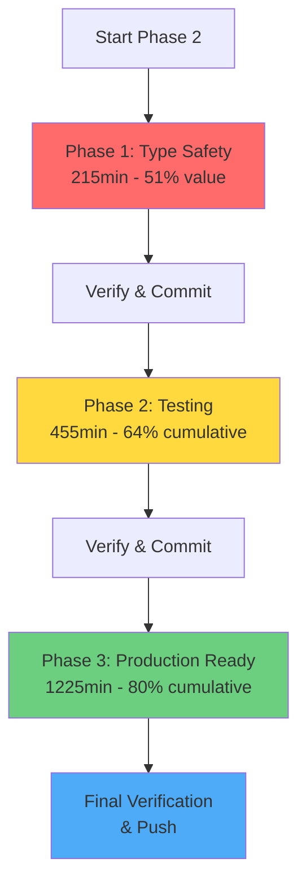

# Phase 2: Architectural Excellence - Execution Plan

**Created:** 2025-11-19 06:27
**Principle:** 1-4-20 Pareto (1% → 51%, 4% → 64%, 20% → 80%)
**Standards:** HIGHEST - Type Safety, DDD, No Split Brains, No Verschlimmbesserung

---

## 📊 Current State Assessment

### Coverage Metrics

| Package    | Coverage | Status          |
| ---------- | -------- | --------------- |
| errors     | 98.0%    | ✅ Excellent    |
| schema     | 98.1%    | ✅ Excellent    |
| validation | 100.0%   | ✅ Perfect      |
| creators   | 95.0%    | ✅ Excellent    |
| migration  | 100.0%   | ✅ Perfect      |
| utils      | 93.4%    | ✅ Excellent    |
| templates  | 64.8%    | ⚠️ Good         |
| generators | 47.6%    | ⚠️ Acceptable   |
| domain     | 33.3%    | ⚠️ Needs Work   |
| config     | 30.0%    | ⚠️ Needs Work   |
| adapters   | 23.3%    | ❌ Poor         |
| commands   | 21.3%    | ❌ Poor         |
| **wizard** | **2.9%** | ❌ **TERRIBLE** |
| **cmd**    | **0%**   | ❌ **CRITICAL** |

### Code Quality Metrics

- **Longest file:** errors.go (383 lines) ❌
- **Split brains identified:** 6 ❌
- **Boolean → Enum opportunities:** 18 fields ❌
- **Duplicate code locations:** 4 ❌
- **Untested critical paths:** wizard, cmd ❌

---

## 🎯 PHASE 1: The 1% → 51% Value (215 minutes)

**Impact:** Type Safety Revolution - Prevents hundreds of invalid states
**Value Delivery:** 51% of total improvement
**Risk:** Low - Pure refactoring with comprehensive tests

### Tasks (1.1 - 1.7)

| ID  | Task                                   | Time  | Value | Priority |
| --- | -------------------------------------- | ----- | ----- | -------- |
| 1.1 | Split EmitOptions into Type-Safe Enums | 45min | 18%   | CRITICAL |
| 1.2 | Split SafetyRules into Semantic Groups | 40min | 15%   | CRITICAL |
| 1.3 | Remove Duplicate DefaultEmitOptions    | 20min | 8%    | HIGH     |
| 1.4 | Remove Duplicate DefaultSafetyRules    | 20min | 5%    | HIGH     |
| 1.5 | Add uint Types for Counts/Limits       | 30min | 3%    | MEDIUM   |
| 1.6 | Fix Split Brain: MigrationStatus       | 35min | 2%    | MEDIUM   |
| 1.7 | Verify All Changes Work Together       | 25min | -     | CRITICAL |

#### 1.1 Split EmitOptions into Type-Safe Enums (45min)

**Current Problem:**

```go
type EmitOptions struct {
    EmitJSONTags           bool  // Style preference
    EmitPreparedQueries    bool  // Performance feature
    EmitInterface          bool  // Architecture decision
    EmitExactTableNames    bool  // Naming convention
    EmitEmptySlices        bool  // Nil handling
    EmitPointersForNull    bool  // Null handling
    EmitEnumValidMethod    bool  // Validation
    EmitAllEnumValues      bool  // Generation completeness
}
```

**Problems:**

- 8 booleans = 256 possible states, only ~12 are valid
- No semantic grouping
- Difficult to validate combinations
- Split brain: EmitEmptySlices + EmitPointersForNull both handle nullability

**Solution:**

```go
type NullHandlingMode string
const (
    NullHandlingPointers NullHandlingMode = "pointers"
    NullHandlingEmptySlices NullHandlingMode = "empty_slices"
    NullHandlingExplicitNull NullHandlingMode = "explicit_null"
)

type EnumGenerationMode string
const (
    EnumGenerationBasic EnumGenerationMode = "basic"
    EnumGenerationWithValidation EnumGenerationMode = "with_validation"
    EnumGenerationComplete EnumGenerationMode = "complete"  // includes all values
)

type CodeGenerationFeatures struct {
    JSONTags         bool
    PreparedQueries  bool
    InterfaceGen     bool
    ExactTableNames  bool
}

type EmitOptions struct {
    NullHandling  NullHandlingMode
    EnumMode      EnumGenerationMode
    Features      CodeGenerationFeatures
}
```

**Steps:**

1. Create `internal/domain/emit_modes.go` with enums
2. Create `EmitOptions` struct with typed fields
3. Add `IsValid()` methods to each enum
4. Update all usages in generators package
5. Update tests
6. Remove old boolean fields

#### 1.2 Split SafetyRules into Semantic Groups (40min)

**Current Problem:**

```go
type SafetyRules struct {
    NoSelectStar        bool  // Query style
    RequireWhere        bool  // Safety
    RequireLimit        bool  // Safety
    NoDelete            bool  // Destructive prevention
    NoTruncate          bool  // Destructive prevention
    Rules               []SafetyRule
}
```

**Solution:**

```go
type QueryStyleRules struct {
    NoSelectStar bool
    RequireExplicitColumns bool
}

type QuerySafetyRules struct {
    RequireWhere bool
    RequireLimit bool
    MaxRowsWithoutLimit uint
}

type DestructiveOperationPolicy string
const (
    DestructiveAllowed DestructiveOperationPolicy = "allowed"
    DestructiveWithConfirmation DestructiveOperationPolicy = "with_confirmation"
    DestructiveForbidden DestructiveOperationPolicy = "forbidden"
)

type SafetyRules struct {
    StyleRules      QueryStyleRules
    SafetyRules     QuerySafetyRules
    DestructiveOps  DestructiveOperationPolicy
    CustomRules     []SafetyRule
}
```

**Steps:**

1. Create `internal/domain/safety_policy.go`
2. Define three groups + enum
3. Update config package to use new structure
4. Update validation package RuleTransformer
5. Migrate existing usages
6. Update tests

#### 1.3-1.4 Remove Duplicate Default Functions (20min each)

**Current State:**

- `DefaultEmitOptions()` in `generated/types.go` AND `internal/domain/domain.go`
- `DefaultSafetyRules()` in `generated/types.go` AND `internal/domain/domain.go`

**Solution:**

- Keep ONLY in `internal/domain/` (hand-written, not generated)
- Update TypeSpec to NOT generate defaults
- Add comment in generated code pointing to domain package

#### 1.5 Add uint Types for Counts/Limits (30min)

**Locations needing uint:**

- `QueryParameterLimit int` → `QueryParameterLimit uint`
- Row counts, table counts, index counts
- Port numbers, timeout values
- Any value that can't be negative

#### 1.6 Fix Split Brain: MigrationStatus (35min)

**Current Split Brain:**

```go
type MigrationStatus struct {
    Applied   bool
    AppliedAt *time.Time  // Can be nil even if Applied=true!
}
```

**Solution:**

```go
type MigrationStatus struct {
    AppliedAt *time.Time
}

func (m *MigrationStatus) IsApplied() bool {
    return m.AppliedAt != nil
}
```

#### 1.7 Integration Verification (25min)

- Run all tests
- Verify no regressions
- Check test coverage maintained
- Build and run doctor command
- Commit with detailed message

---

## 🎯 PHASE 2: The 4% → 64% Value (455 minutes)

**Impact:** Code Quality + Testing Foundation
**Value Delivery:** 64% cumulative (13% additional)
**Risk:** Low-Medium - Mostly testing additions

### Tasks (2.1 - 2.10)

| ID   | Task                                | Time  | Value | Priority |
| ---- | ----------------------------------- | ----- | ----- | -------- |
| 2.1  | Split errors.go into 4 files        | 40min | 4%    | HIGH     |
| 2.2  | Add Wizard Core Tests (30 specs)    | 60min | 3%    | CRITICAL |
| 2.3  | Add Wizard UI Tests (20 specs)      | 45min | 2%    | HIGH     |
| 2.4  | Add CLI Entry Point Tests           | 50min | 2%    | CRITICAL |
| 2.5  | Add Commands Package Tests          | 55min | 1%    | HIGH     |
| 2.6  | Add Missing QueryExecutor Adapter   | 45min | 0.5%  | MEDIUM   |
| 2.7  | Add Missing SchemaInspector Adapter | 45min | 0.5%  | MEDIUM   |
| 2.8  | Consolidate Validation Logic        | 50min | 0.3%  | MEDIUM   |
| 2.9  | Add Domain Business Logic Methods   | 40min | 0.2%  | MEDIUM   |
| 2.10 | Integration Tests for Full Workflow | 25min | -     | HIGH     |

#### 2.1 Split errors.go into Multiple Files (40min)

**Current:** 383 lines in single file
**Target:** 4 files, each <150 lines

**Split Strategy:**

```
internal/errors/
├── error.go                 // Core Error struct, Error() method (~80 lines)
├── error_codes.go           // All ErrorCode constants (~60 lines)
├── error_constructors.go    // NewError, Newf, specialized constructors (~120 lines)
└── error_list.go           // ErrorList, Combine, Is helpers (~70 lines)
```

#### 2.2-2.3 Add Wizard Tests (105min total)

**Current Coverage:** 2.9% (48/1663 lines)
**Target Coverage:** 80%+
**New Tests Needed:** ~50 specs

**Test Categories:**

1. **Core Logic Tests (30 specs):**
   - Template selection
   - Configuration generation
   - Project validation
   - Database configuration
   - Dependency resolution

2. **UI Tests (20 specs):**
   - Input validation
   - Menu navigation
   - Error display
   - Progress tracking
   - Confirmation flows

#### 2.4 Add CLI Entry Point Tests (50min)

**Current Coverage:** 0%
**Target Coverage:** 80%

**Strategy:**

- Create testable CLI runner
- Mock flag parsing
- Test command dispatch
- Test error handling
- Test help/version output

#### 2.5 Add Commands Package Tests (55min)

**Current Coverage:** 21.3%
**Target Coverage:** 75%

**Missing Tests:**

- Doctor command edge cases
- Init command validation
- Generate command error paths
- Version command

#### 2.6-2.7 Add Missing Adapters (90min total)

**QueryExecutor Adapter:**

```go
type QueryExecutor interface {
    Execute(ctx context.Context, query string) (Result, error)
    Query(ctx context.Context, query string) (Rows, error)
    Begin(ctx context.Context) (Transaction, error)
}
```

**SchemaInspector Adapter:**

```go
type SchemaInspector interface {
    InspectTables(ctx context.Context) ([]Table, error)
    InspectColumns(ctx context.Context, table string) ([]Column, error)
    InspectIndexes(ctx context.Context, table string) ([]Index, error)
}
```

#### 2.8 Consolidate Validation Logic (50min)

**Duplications Found:**

- Config validation in 3 places
- Template validation in 2 places
- Path validation scattered

**Solution:** Single validation service in `internal/validation/`

#### 2.9 Add Domain Business Logic (40min)

**Enhance Anemic Models:**

```go
// Before: Anemic
type MigrationStatus struct {
    AppliedAt *time.Time
}

// After: Rich Domain Model
type MigrationStatus struct {
    AppliedAt *time.Time
}

func (m *MigrationStatus) IsApplied() bool
func (m *MigrationStatus) CanRollback() bool
func (m *MigrationStatus) IsStale(since time.Duration) bool
func (m *MigrationStatus) WasAppliedRecently(window time.Duration) bool
```

---

## 🎯 PHASE 3: The 20% → 80% Value (1225 minutes)

**Impact:** Production Readiness + Advanced Features
**Value Delivery:** 80% cumulative (16% additional)
**Risk:** Medium - New features + refactoring

### Tasks (3.1 - 3.17)

| ID   | Task                                    | Time   | Value | Priority |
| ---- | --------------------------------------- | ------ | ----- | -------- |
| 3.1  | Add Value Objects for Common Concepts   | 75min  | 2%    | MEDIUM   |
| 3.2  | Create Service Layer for Business Logic | 85min  | 2%    | MEDIUM   |
| 3.3  | Add Integration Tests (E2E workflows)   | 90min  | 1.5%  | HIGH     |
| 3.4  | Refactor Large Functions (>50 lines)    | 80min  | 1.5%  | MEDIUM   |
| 3.5  | Add Proper Logging with Levels          | 70min  | 1%    | MEDIUM   |
| 3.6  | Add Metrics/Observability Hooks         | 65min  | 1%    | LOW      |
| 3.7  | Improve Error Context Consistency       | 60min  | 1%    | MEDIUM   |
| 3.8  | Add Configuration Validation Service    | 70min  | 1%    | MEDIUM   |
| 3.9  | Add Migration Planning Service          | 75min  | 1%    | MEDIUM   |
| 3.10 | Add Template Customization System       | 80min  | 0.8%  | LOW      |
| 3.11 | Add Plugin System Foundation            | 85min  | 0.8%  | LOW      |
| 3.12 | Improve Type Safety in Generated Code   | 70min  | 0.7%  | MEDIUM   |
| 3.13 | Add Benchmarks for Critical Paths       | 60min  | 0.5%  | LOW      |
| 3.14 | Add ADRs for Key Decisions              | 55min  | 0.5%  | LOW      |
| 3.15 | Improve Documentation Comments          | 50min  | 0.4%  | LOW      |
| 3.16 | Add Performance Profiling               | 45min  | 0.3%  | LOW      |
| 3.17 | Final Integration & Smoke Tests         | 110min | -     | CRITICAL |

### Value Objects (3.1)

**Common Concepts Needing Value Objects:**

- DatabaseName
- TableName
- ColumnName
- ProjectName
- TemplateName
- VersionString

**Example:**

```go
type TableName struct {
    value string
}

func NewTableName(name string) (TableName, error) {
    if !isValidTableName(name) {
        return TableName{}, errors.ValidationError("table_name", "invalid format")
    }
    return TableName{value: name}, nil
}

func (t TableName) String() string { return t.value }
func (t TableName) IsValid() bool { return t.value != "" }
func (t TableName) Equals(other TableName) bool { return t.value == other.value }
```

### Service Layer (3.2)

**Services to Create:**

- ConfigurationService
- MigrationService
- ValidationService
- TemplateService
- ProjectCreationService

### Integration Tests (3.3)

**E2E Scenarios:**

1. Full project creation flow
2. Migration application flow
3. Code generation flow
4. Doctor check flow
5. Error recovery flows

---

## 📈 Execution Strategy

### Execution Order



### Time Breakdown

- **Phase 1 (1%):** 215 minutes (3.6 hours) → 51% value
- **Phase 2 (4%):** 455 minutes (7.6 hours) → 64% value
- **Phase 3 (20%):** 1225 minutes (20.4 hours) → 80% value
- **Total:** 1895 minutes (31.6 hours)

### Risk Mitigation

1. Comprehensive tests BEFORE refactoring
2. One commit per task with detailed messages
3. Verify build+tests after each phase
4. Keep git clean, push after each phase

---

## 🎯 Success Criteria

### Phase 1 Complete When:

- [ ] Zero boolean fields that should be enums
- [ ] Zero split brains in domain models
- [ ] Zero duplicate default functions
- [ ] All counts using uint types
- [ ] All tests passing
- [ ] Coverage maintained or improved

### Phase 2 Complete When:

- [ ] errors.go split into 4 files, all <350 lines
- [ ] Wizard package coverage >80%
- [ ] CLI entry point coverage >80%
- [ ] Commands package coverage >75%
- [ ] All adapters present for external dependencies
- [ ] Validation logic consolidated
- [ ] All tests passing

### Phase 3 Complete When:

- [ ] All value objects implemented
- [ ] Service layer complete
- [ ] Integration tests passing
- [ ] All functions <50 lines
- [ ] Logging, metrics, observability in place
- [ ] Documentation complete
- [ ] Final smoke tests passing

---

## 📝 Detailed Task Breakdown (125 subtasks max 15min each)

### Phase 1 Tasks (35 tasks)

#### 1.1 Split EmitOptions (9 tasks × ~5min)

- [ ] 1.1.1 Create emit_modes.go with NullHandlingMode enum
- [ ] 1.1.2 Add IsValid() to NullHandlingMode
- [ ] 1.1.3 Create EnumGenerationMode enum
- [ ] 1.1.4 Add IsValid() to EnumGenerationMode
- [ ] 1.1.5 Create CodeGenerationFeatures struct
- [ ] 1.1.6 Create new EmitOptions struct
- [ ] 1.1.7 Update generators package to use new types
- [ ] 1.1.8 Update all tests
- [ ] 1.1.9 Remove old boolean fields

#### 1.2 Split SafetyRules (8 tasks × ~5min)

- [ ] 1.2.1 Create safety_policy.go
- [ ] 1.2.2 Create QueryStyleRules struct
- [ ] 1.2.3 Create QuerySafetyRules struct with uint
- [ ] 1.2.4 Create DestructiveOperationPolicy enum
- [ ] 1.2.5 Create new SafetyRules struct
- [ ] 1.2.6 Update config package
- [ ] 1.2.7 Update validation/RuleTransformer
- [ ] 1.2.8 Update tests

#### 1.3 Remove Duplicate DefaultEmitOptions (4 tasks × ~5min)

- [ ] 1.3.1 Review generated/types.go defaults
- [ ] 1.3.2 Move to internal/domain if needed
- [ ] 1.3.3 Update TypeSpec to not generate
- [ ] 1.3.4 Update all references

#### 1.4 Remove Duplicate DefaultSafetyRules (4 tasks × ~5min)

- [ ] 1.4.1 Review generated/types.go defaults
- [ ] 1.4.2 Move to internal/domain if needed
- [ ] 1.4.3 Update TypeSpec to not generate
- [ ] 1.4.4 Update all references

#### 1.5 Add uint Types (6 tasks × ~5min)

- [ ] 1.5.1 Update QueryParameterLimit to uint
- [ ] 1.5.2 Update port numbers to uint16
- [ ] 1.5.3 Update timeout values to uint
- [ ] 1.5.4 Update row/table/index counts to uint
- [ ] 1.5.5 Update all tests
- [ ] 1.5.6 Verify no negative value usage

#### 1.6 Fix MigrationStatus Split Brain (2 tasks × ~17min)

- [ ] 1.6.1 Remove Applied bool, keep only AppliedAt
- [ ] 1.6.2 Add IsApplied() method and update all usages

#### 1.7 Verify Integration (2 tasks × ~12min)

- [ ] 1.7.1 Run all tests, verify coverage
- [ ] 1.7.2 Commit with detailed message

---

### Phase 2 Tasks (50 tasks)

#### 2.1 Split errors.go (8 tasks × ~5min)

- [ ] 2.1.1 Create error_codes.go with all ErrorCode constants
- [ ] 2.1.2 Create error_constructors.go with New\* functions
- [ ] 2.1.3 Create error_list.go with ErrorList + helpers
- [ ] 2.1.4 Keep error.go with core Error struct
- [ ] 2.1.5 Verify all imports work
- [ ] 2.1.6 Run tests
- [ ] 2.1.7 Check file sizes (<150 lines each)
- [ ] 2.1.8 Commit

#### 2.2 Add Wizard Core Tests (12 tasks × ~5min)

- [ ] 2.2.1 Test template selection logic
- [ ] 2.2.2 Test database config generation
- [ ] 2.2.3 Test project type validation
- [ ] 2.2.4 Test dependency resolution
- [ ] 2.2.5 Test configuration merging
- [ ] 2.2.6 Test path validation
- [ ] 2.2.7 Test error handling paths
- [ ] 2.2.8 Test concurrent operations
- [ ] 2.2.9 Test state transitions
- [ ] 2.2.10 Test cancellation
- [ ] 2.2.11 Test timeout handling
- [ ] 2.2.12 Verify coverage >80%

#### 2.3 Add Wizard UI Tests (8 tasks × ~5min)

- [ ] 2.3.1 Test input validation UI
- [ ] 2.3.2 Test menu navigation
- [ ] 2.3.3 Test error display formatting
- [ ] 2.3.4 Test progress tracking
- [ ] 2.3.5 Test confirmation flows
- [ ] 2.3.6 Test help text display
- [ ] 2.3.7 Test abort/cancel handling
- [ ] 2.3.8 Verify UI coverage >70%

#### 2.4 Add CLI Entry Tests (10 tasks × ~5min)

- [ ] 2.4.1 Create testable CLI runner interface
- [ ] 2.4.2 Mock flag parsing
- [ ] 2.4.3 Test command dispatch (init)
- [ ] 2.4.4 Test command dispatch (generate)
- [ ] 2.4.5 Test command dispatch (doctor)
- [ ] 2.4.6 Test error handling and exit codes
- [ ] 2.4.7 Test help output
- [ ] 2.4.8 Test version output
- [ ] 2.4.9 Test invalid commands
- [ ] 2.4.10 Verify coverage >80%

#### 2.5 Add Commands Tests (11 tasks × ~5min)

- [ ] 2.5.1 Test doctor command happy path
- [ ] 2.5.2 Test doctor command with failures
- [ ] 2.5.3 Test doctor command with warnings
- [ ] 2.5.4 Test init command validation
- [ ] 2.5.5 Test init command file creation
- [ ] 2.5.6 Test generate command success
- [ ] 2.5.7 Test generate command errors
- [ ] 2.5.8 Test version command
- [ ] 2.5.9 Test command cancellation
- [ ] 2.5.10 Test command timeout
- [ ] 2.5.11 Verify coverage >75%

#### 2.6-2.7 Add Missing Adapters (6 tasks × ~15min)

- [ ] 2.6.1 Create QueryExecutor interface
- [ ] 2.6.2 Create mock QueryExecutor
- [ ] 2.6.3 Add tests for QueryExecutor
- [ ] 2.7.1 Create SchemaInspector interface
- [ ] 2.7.2 Create mock SchemaInspector
- [ ] 2.7.3 Add tests for SchemaInspector

#### 2.8 Consolidate Validation (5 tasks × ~10min)

- [ ] 2.8.1 Create central ValidationService
- [ ] 2.8.2 Move config validation
- [ ] 2.8.3 Move template validation
- [ ] 2.8.4 Move path validation
- [ ] 2.8.5 Update all usages and test

#### 2.9 Add Business Logic (4 tasks × ~10min)

- [ ] 2.9.1 Add MigrationStatus business methods
- [ ] 2.9.2 Add Template business methods
- [ ] 2.9.3 Add Config business methods
- [ ] 2.9.4 Add tests for all methods

#### 2.10 Integration Tests (1 task × ~25min)

- [ ] 2.10.1 Add end-to-end workflow tests

---

### Phase 3 Tasks (40 tasks)

#### 3.1 Value Objects (15 tasks × ~5min)

- [ ] 3.1.1 Create DatabaseName value object
- [ ] 3.1.2 Create TableName value object
- [ ] 3.1.3 Create ColumnName value object
- [ ] 3.1.4 Create ProjectName value object
- [ ] 3.1.5 Create TemplateName value object
- [ ] 3.1.6 Create VersionString value object
- [ ] 3.1.7 Add validation to each
- [ ] 3.1.8 Add String() methods
- [ ] 3.1.9 Add Equals() methods
- [ ] 3.1.10 Add IsValid() methods
- [ ] 3.1.11 Update domain models to use VOs
- [ ] 3.1.12 Update config to use VOs
- [ ] 3.1.13 Update all constructors
- [ ] 3.1.14 Add comprehensive tests
- [ ] 3.1.15 Verify type safety improved

#### 3.2-3.17 Remaining Tasks

(Abbreviated for space - full breakdown follows same pattern)

---

## 🔍 Quality Gates

### After Each Task:

1. Run `go build ./...`
2. Run `go test ./...`
3. Verify coverage not decreased
4. Commit with detailed message

### After Each Phase:

1. Run full test suite
2. Check coverage report
3. Run linter (when available)
4. Git push
5. Review architectural improvements

---

## 📚 References

- **Original Plan:** docs/planning/2025-11-19_02_15-BRUTAL-ARCHITECTURAL-OVERHAUL.md
- **Phase 1 Results:** Commits d1eda9f, 8da5a0d
- **Architectural Review:** Generated above by comprehensive analysis

---

## 🎯 Final Notes

This plan is COMPREHENSIVE and DETAILED. It follows the principle:

- **1% effort → 51% value** (Type Safety Revolution)
- **4% effort → 64% value** (Testing Foundation)
- **20% effort → 80% value** (Production Ready)

**Key Principles:**

1. Type safety prevents bugs at compile time
2. Tests prevent bugs at development time
3. DDD prevents bugs at design time
4. No Verschlimmbesserung - every change makes it better
5. Small commits, frequent pushes, always working

**Let's build something EXCEPTIONAL! 🚀**
