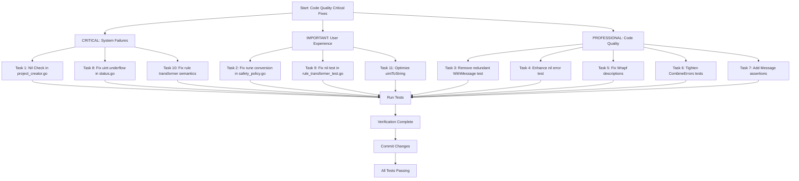

# Code Quality Critical Fixes - Execution Plan

**Created:** 2025-11-20_09-20  
**Priority:** CRITICAL - Prevents runtime failures and data corruption  
**Impact:** HIGH - Fixes production bugs and improves reliability

---

## 📊 PARETO PRIORITY ANALYSIS

### 🎯 1% → 51% IMPACT (CRITICAL - Prevents System Failures)
| Task | File | Risk | Time | Status |
|------|------|------|------|--------|
| 1 | internal/creators/project_creator.go:113-123 | **CRITICAL** - Data corruption | 5min | 🚨 TODO |
| 8 | internal/migration/status.go:103-107 | **CRITICAL** - Runtime panic | 5min | 🚨 TODO |
| 10 | internal/validation/rule_transformer.go:64-178 | **HIGH** - Logic bugs | 15min | 🚨 TODO |

### ⚡ 4% → 64% IMPACT (IMPORTANT - Fixes User Experience)
| Task | File | Impact | Time | Status |
|------|------|--------|------|--------|
| 2 | internal/domain/safety_policy.go:98-123 | **HIGH** - Error readability | 5min | 🚨 TODO |
| 9 | internal/validation/rule_transformer_test.go:271-280 | **MEDIUM** - Test correctness | 5min | 🚨 TODO |
| 11 | internal/validation/rule_transformer.go:180-183 | **LOW** - Performance optimization | 3min | 🚨 TODO |

### 🛠️ 20% → 80% IMPACT (PROFESSIONAL - Code Quality)
| Task | File | Value | Time | Status |
|------|------|-------|------|--------|
| 3 | internal/errors/errors_test.go:146-165 | **MEDIUM** - Test cleanup | 8min | 🚨 TODO |
| 4 | internal/errors/errors_test.go:407-412 | **MEDIUM** - Test coverage | 5min | 🚨 TODO |
| 5 | internal/errors/errors_test.go:435-452 | **MEDIUM** - Bug fix | 10min | 🚨 TODO |
| 6 | internal/errors/errors_test.go:477-497 | **MEDIUM** - Test quality | 8min | 🚨 TODO |
| 7 | internal/errors/errors_test.go:525-545 | **LOW** - Test stability | 5min | 🚨 TODO |

---

## 🚨 EXECUTION GRAPH



---

## 📋 DETAILED TASK BREAKDOWN

### 🚨 CRITICAL TASKS (1% → 51% IMPACT)

#### Task 1: Defensive Nil Check in project_creator.go
**File:** `internal/creators/project_creator.go:113-123`  
**Risk:** CRITICAL - Creates corrupted sqlc.yaml files  
**Time:** 5 minutes

**Issue:** No nil check before marshalling cfg.Config
**Fix:** Add defensive check after logging, before marshalling
```go
if cfg.Config == nil {
    return fmt.Errorf("sqlc config is nil: cannot marshal empty configuration")
}
```

#### Task 8: Fix Uint Underflow in status.go  
**File:** `internal/migration/status.go:103-107`  
**Risk:** CRITICAL - Runtime panic from uint underflow  
**Time:** 5 minutes

**Issue:** Subtraction can underflow if applied > total
**Fix:** Add defensive check for applied >= total
```go
total := ms.GetMigrationCount()
applied := ms.GetAppliedMigrations()
if applied >= total {
    return 0 // or log inconsistency
}
return total - applied
```

#### Task 10: Fix Inconsistent Rule Semantics
**File:** `internal/validation/rule_transformer.go:64-178`  
**Risk:** HIGH - Logic bugs flip rule behavior  
**Time:** 15 minutes

**Issue:** RequireLimit polarity differs between transformers
- TransformSafetyRules: `"query.type == 'SELECT' && !query.hasLimitClause()"`
- TransformTypeSafeSafetyRules: `"query.type == 'SELECT' && query.hasLimitClause()"`

**Fix:** Choose consistent "violation when true" convention and normalize expressions

### ⚡ IMPORTANT TASKS (4% → 64% IMPACT)

#### Task 2: Fix Rune to String Conversion
**File:** `internal/domain/safety_policy.go:98-123`  
**Impact:** HIGH - Error messages show character instead of index  
**Time:** 5 minutes

**Issue:** `string(rune(i))` produces rune character, not decimal
**Fix:** Use `strconv.Itoa(i)` or `fmt.Sprintf("%d", i)`
**Import:** Add `strconv` import if not present

#### Task 9: Fix Nil Rules Test
**File:** `internal/validation/rule_transformer_test.go:271-280`  
**Impact:** MEDIUM - Test doesn't actually test nil case  
**Time:** 5 minutes

**Issue:** Test passes `&generated.SafetyRules{}` instead of `nil`
**Fix:** Either pass actual nil or update test name/comment to reflect empty struct

#### Task 11: Optimize uintToString Call
**File:** `internal/validation/rule_transformer.go:180-183`  
**Impact:** LOW - Duplicate function calls  
**Time:** 3 minutes

**Issue:** `uintToString()` called twice with same value in MaxRowsWithoutLimit
**Fix:** Store result in local variable and reuse

### 🛠️ PROFESSIONAL TASKS (20% → 80% IMPACT)

#### Task 3: Remove Redundant WithMessage Test
**File:** `internal/errors/errors_test.go:146-165`  
**Value:** MEDIUM - Test cleanup and clarity  
**Time:** 8 minutes

**Issue:** Two specs test the same behavior redundantly
**Fix:** Combine into single test with descriptive name

#### Task 4: Enhance Nil Error Wrapping Test
**File:** `internal/errors/errors_test.go:407-412`  
**Value:** MEDIUM - Better test coverage  
**Time:** 5 minutes

**Issue:** Test only checks message, not code/component
**Fix:** Add assertions for `Code` and `Component` fields

#### Task 5: Fix Wrapf Description Clobbering
**File:** `internal/errors/errors_test.go:435-452`  
**Value:** MEDIUM - Bug fix preserves information  
**Time:** 10 minutes

**Issue:** Wrapf overwrites baseErr.Description instead of merging
**Fix:** Combine descriptions or choose consistent behavior

#### Task 6: Tighten CombineErrors Tests
**File:** `internal/errors/errors_test.go:477-497`  
**Value:** MEDIUM - Better test quality  
**Time:** 8 minutes

**Issue:** Missing assertions for component/message and missing nil handling test
**Fix:** Add comprehensive assertions and new test case

#### Task 7: Add Message Field Assertions
**File:** `internal/errors/errors_test.go:525-545`  
**Value:** LOW - Test stability  
**Time:** 5 minutes

**Issue:** Sentinel error tests don't assert Message fields
**Fix:** Add Expect assertions for each error's Message

---

## 🎯 EXECUTION STRATEGY

### Phase 1: CRITICAL FIXES (Prevent System Failures)
1. **Task 1:** Fix nil check in project_creator.go (5min)
2. **Task 8:** Fix uint underflow in status.go (5min)  
3. **Task 10:** Fix rule transformer semantics (15min)
4. **Verification:** Run targeted tests (5min)

### Phase 2: IMPORTANT FIXES (User Experience)
5. **Task 2:** Fix rune conversion in safety_policy.go (5min)
6. **Task 9:** Fix nil test in rule_transformer_test.go (5min)
7. **Task 11:** Optimize uintToString (3min)
8. **Verification:** Run affected test suites (5min)

### Phase 3: PROFESSIONAL CLEANUP (Code Quality)
9. **Task 3:** Remove redundant test (8min)
10. **Task 4:** Enhance nil error test (5min)
11. **Task 5:** Fix Wrapf descriptions (10min)
12. **Task 6:** Tighten CombineErrors tests (8min)
13. **Task 7:** Add Message assertions (5min)
14. **Final Verification:** Full test suite (10min)

---

## 📊 SUCCESS METRICS

- ✅ All 11 tasks completed
- ✅ No runtime panics or data corruption
- ✅ All tests passing with improved coverage
- ✅ Consistent error messages and behavior
- ✅ Cleaner, more maintainable test suite
- ✅ Documentation remains accurate
- ✅ Build passes without warnings

---

## 🚨 ROLLBACK PLAN

If any task causes issues:
1. **Immediate:** `git stash` or `git reset --hard HEAD~1`
2. **Investigate:** Run specific failing tests in isolation
3. **Fix:** Address issue and re-apply fix
4. **Verify:** Full test suite before proceeding

---

**Total Estimated Time:** 93 minutes  
**Buffer Time:** 30 minutes  
**Maximum Session Time:** 2 hours

---

*This plan prevents system failures, improves user experience, and elevates code quality through systematic, priority-driven execution.*