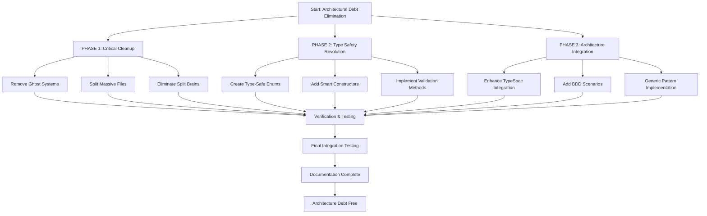

# 🚀 CRITICAL ARCHITECTURAL DEBT ELIMINATION - EXECUTION PLAN

**Created:** 2025-11-20_09-55  
**Scope:** Eliminate technical debt, type safety revolution, architectural cleanup  
**Timeline:** 2 weeks intensive execution  
**Priority:** Pareto-optimal (highest impact, lowest effort first)

---

## 📊 EXECUTION GRAPH

---

## 🎯 PHASE 1: CRITICAL CLEANUP (Week 1)

### 1.1 Remove Ghost Systems (Effort: 30min, Impact: 🔥 HIGH)

**Step 1.1.1:** Audit ghost systems (10min)
- [ ] Check `internal/events/` directory usage across codebase
- [ ] Verify `internal/testing/` directory references
- [ ] Identify any other empty directories
- [ ] Search for unused import statements

**Step 1.1.2:** Remove unused directories (15min)
- [ ] Delete empty `internal/events/` directory
- [ ] Delete empty `internal/testing/` directory
- [ ] Remove any other unused directories
- [ ] Update architecture documentation to reflect removal

**Step 1.1.3:** Update import statements (5min)
- [ ] Remove any imports referencing deleted directories
- [ ] Run build to verify no broken imports
- [ ] Commit changes with descriptive message

### 1.2 Split Massive Test Files (Effort: 2h, Impact: 🔥 HIGH)

**Step 1.2.1:** Split `rule_transformer_test.go` (651→<350 lines) (30min)
- [ ] Analyze test groups in file
- [ ] Create `rule_transformer_unit_test.go` for unit tests
- [ ] Create `rule_transformer_integration_test.go` for integration tests
- [ ] Move appropriate tests to new files
- [ ] Ensure all imports and setup are correct

**Step 1.2.2:** Split `errors_test.go` (557→<350 lines) (25min)
- [ ] Create `errors_unit_test.go` for core error tests
- [ ] Create `errors_integration_test.go` for error combination tests
- [ ] Create `errors_sentinel_test.go` for sentinel error tests
- [ ] Organize tests logically by functionality

**Step 1.2.3:** Split `conversions_test.go` (505→<350 lines) (20min)
- [ ] Create `conversions_domain_test.go` for domain conversions
- [ ] Create `conversions_validation_test.go` for validation conversions
- [ ] Split by conversion type and purpose
- [ ] Ensure test isolation and clarity

**Step 1.2.4:** Split remaining large files (45min)
- [ ] Split `schema_test.go` (472 lines) into schema unit/integration tests
- [ ] Split `emit_modes_test.go` (420 lines) into focused test files
- [ ] Verify all test files are under 350 lines
- [ ] Update test suite configuration if needed

### 1.3 Eliminate Rule Transformer Split Brains (Effort: 3h, Impact: 🔥 HIGH)

**Step 1.3.1:** Analyze current split brain (30min)
- [ ] Compare `TransformDomainSafetyRules` vs `TransformTypeSafeSafetyRules`
- [ ] Identify all differences and edge cases
- [ ] Determine which implementation is superior
- [ ] Map all usage locations across codebase

**Step 1.3.2:** Create unified transformation method (90min)
- [ ] Design single `TransformRules` method accepting both types
- [ ] Implement proper type checking and conversion
- [ ] Ensure all existing functionality preserved
- [ ] Add comprehensive error handling for invalid inputs

**Step 1.3.3:** Migrate callers to unified method (45min)
- [ ] Find all usages of both methods
- [ ] Update callers to use new unified method
- [ ] Remove deprecated `TransformDomainSafetyRules` method
- [ ] Add deprecation warning if temporary compatibility needed

**Step 1.3.4:** Comprehensive testing (15min)
- [ ] Test unified method with both input types
- [ ] Verify identical output for equivalent inputs
- [ ] Add edge case tests for type conversion
- [ ] Ensure no regressions in functionality

---

## 🎯 PHASE 2: TYPE SAFETY REVOLUTION (Week 2)

### 2.1 Create Type-Safe Enums (Effort: 4h, Impact: 🔥 HIGH)

**Step 2.1.1:** Analyze boolean flags (30min)
- [ ] Catalog all `bool` fields in domain types
- [ ] Group related flags into semantic categories
- [ ] Design enum structures to replace booleans
- [ ] Plan migration strategy preserving existing API

**Step 2.1.2:** Create StyleRule enums (60min)
- [ ] Define `SelectStarPolicy` enum (forbidden, allowed, explicit-required)
- [ ] Define `ColumnRequirement` enum (any, explicit, named)
- [ ] Add validation methods and smart constructors
- [ ] Ensure backward compatibility during migration

**Step 2.1.3:** Create SafetyRule enums (60min)
- [ ] Define `WhereRequirement` enum (optional, required-select, required-dml, required-all)
- [ ] Define `LimitPolicy` enum (none, suggested, required, strict)
- [ ] Add comprehensive validation methods
- [ ] Implement policy combination logic

**Step 2.1.4:** Update domain types (90min)
- [ ] Replace `bool` fields with new enum types
- [ ] Update `QueryStyleRules` struct with new enums
- [ ] Update `QuerySafetyRules` struct with new enums
- [ ] Ensure all invalid states are unrepresentable

### 2.2 Add Smart Constructors (Effort: 2h, Impact: ⚡ MEDIUM)

**Step 2.2.1:** Create constructor validation (30min)
- [ ] Add validation logic for all enum types
- [ ] Design constructor signatures preventing invalid states
- [ ] Add comprehensive error messages for validation failures
- [ ] Ensure validation is performed at construction time

**Step 2.2.2:** Implement smart constructors (60min)
- [ ] Create `NewQueryStyleRules` with validation
- [ ] Create `NewQuerySafetyRules` with validation
- [ ] Create `NewTypeSafeSafetyRules` with validation
- [ ] Add builder pattern for complex configurations

**Step 2.2.3:** Add factory methods (30min)
- [ ] Create preset configurations for common scenarios
- [ ] Add `StrictMode()` factory for maximum safety
- [ ] Add `PermissiveMode()` factory for flexibility
- [ ] Add `RecommendedMode()` factory for balanced approach

### 2.3 Implement Validation Methods (Effort: 1h, Impact: ⚡ MEDIUM)

**Step 2.3.1:** Add enum validation (20min)
- [ ] Implement `IsValid()` method for all new enums
- [ ] Add `String()` method for consistent string representation
- [ ] Add `Values()` method returning all valid options
- [ ] Ensure all validation is comprehensive

**Step 2.3.2:** Add complex validation (40min)
- [ ] Validate enum combinations make sense
- [ ] Add business rule validation for policy interactions
- [ ] Implement conflict detection between settings
- [ ] Add clear error messages for validation failures

---

## 🎯 PHASE 3: ARCHITECTURE INTEGRATION (Week 3-4)

### 3.1 Enhance TypeSpec Integration (Effort: 3h, Impact: ⚡ MEDIUM)

**Step 3.1.1:** Audit TypeSpec models (30min)
- [ ] Compare TypeSpec models with hand-written types
- [ ] Identify gaps and duplications
- [ ] Plan migration strategy for unified approach
- [ ] Document TypeSpec vs domain boundaries clearly

**Step 3.1.2:** Extend TypeSpec models (60min)
- [ ] Add new enum definitions to TypeSpec
- [ ] Generate updated Go types from TypeSpec
- [ ] Ensure generated types include validation methods
- [ ] Update TypeSpec documentation

**Step 3.1.3:** Migrate to TypeSpec-first approach (90min)
- [ ] Replace hand-written enums with TypeSpec-generated
- [ ] Update all imports and references
- [ ] Ensure backward compatibility during migration
- [ ] Remove duplicate hand-written type definitions

### 3.2 Add BDD Scenarios (Effort: 3h, Impact: 🛠️ LOW)

**Step 3.2.1:** Create BDD framework (60min)
- [ ] Set up Ginkgo/Gomega for BDD testing
- [ ] Create feature file structure for behavior tests
- [ ] Define step definitions for common actions
- [ ] Add BDD test runner configuration

**Step 3.2.2:** Write critical path scenarios (90min)
- [ ] Create "wizard creates project" BDD scenarios
- [ ] Create "validation catches errors" BDD scenarios
- [ ] Create "configuration generation" BDD scenarios
- [ ] Create "error handling" BDD scenarios

**Step 3.2.3:** Integrate BDD with CI (30min)
- [ ] Add BDD tests to CI pipeline
- [ ] Configure test reporting for BDD scenarios
- [ ] Ensure BDD tests run in all environments
- [ ] Add BDD coverage reporting

### 3.3 Generic Pattern Implementation (Effort: 2h, Impact: 🛠️ LOW)

**Step 3.3.1:** Identify generic opportunities (30min)
- [ ] Find duplicate patterns in repository implementations
- [ ] Identify adapter patterns that could be generic
- [ ] Locate error handling that could use generics
- [ ] Plan generic implementation strategy

**Step 3.3.2:** Implement generic patterns (90min)
- [ ] Create generic repository interfaces
- [ ] Implement generic error handling patterns
- [ ] Add generic adapter templates
- [ ] Ensure type safety is maintained

---

## 🔍 VERIFICATION STEPS

### After Each Phase:
- [ ] Run full test suite (59+ tests passing)
- [ ] Build clean (`go build ./cmd/sqlc-wizard/`)
- [ ] Run linting (`just lint`)
- [ ] Commit with detailed message
- [ ] Push to remote branch

### Final Verification:
- [ ] All files <350 lines (checked with `find` command)
- [ ] No ghost systems (empty directories)
- [ ] No split brains (duplicate logic)
- [ ] All enums have validation methods
- [ ] Type safety prevents invalid states
- [ ] BDD scenarios cover critical paths
- [ ] Documentation updated and accurate

---

## 📅 EXECUTION SCHEDULE

### **Week 1 (Critical Cleanup)**
- **Monday:** Step 1.1 (Remove Ghost Systems)
- **Tuesday:** Step 1.2.1-1.2.2 (Split 2 largest test files)
- **Wednesday:** Step 1.2.3-1.2.4 (Split remaining test files)
- **Thursday:** Step 1.3.1-1.3.2 (Analyze & create unified transformer)
- **Friday:** Step 1.3.3-1.3.4 (Migrate callers & verify)

### **Week 2 (Type Safety Revolution)**
- **Monday:** Step 2.1.1-2.1.2 (Analyze & create StyleRule enums)
- **Tuesday:** Step 2.1.3-2.1.4 (Create SafetyRule enums & update domain)
- **Wednesday:** Step 2.2.1-2.2.2 (Create smart constructors)
- **Thursday:** Step 2.2.3-2.3.2 (Add factory methods & validation)
- **Friday:** Step 2.3.3 (Final validation) + Verification

### **Week 3-4 (Architecture Integration)**
- **Week 3:** Step 3.1 (TypeSpec integration)
- **Week 4:** Step 3.2-3.3 (BDD & generics) + Final verification

---

## 🎯 SUCCESS METRICS

### **Quantitative Targets:**
- [ ] 0 files >350 lines
- [ ] 0 ghost systems (empty directories)
- [ ] 0 split brains (duplicate logic)
- [ ] 100% of enums have validation methods
- [ ] 100% of domain types have smart constructors
- [ ] 20+ BDD scenarios covering critical paths

### **Qualitative Targets:**
- [ ] Impossible states are unrepresentable
- [ ] Type safety enforced at compile time
- [ ] Clear TypeSpec vs domain boundaries
- [ ] Comprehensive test coverage for all scenarios
- [ ] Architectural decisions documented
- [ ] Easy onboarding for new developers

---

## 🚨 ROLLBACK PROTOCOL

### **If Step Fails:**
1. **Immediate:** `git stash` or `git reset --hard HEAD~1`
2. **Analyze:** Investigate failure in isolation
3. **Fix:** Address root cause before retrying
4. **Verify:** Test fix thoroughly before continuing
5. **Document:** Record learning in status file

### **If Phase Fails:**
1. **Stop:** Halt phase execution
2. **Assess:** Evaluate what's working vs what's not
3. **Replan:** Adjust phase approach with lessons learned
4. **Recommunicate:** Update stakeholders on new plan
5. **Resume:** Continue with adjusted approach

---

## 🎊 FINAL OUTCOME

**Before:** Technical debt, split brains, type safety issues, massive files  
**After:** Clean architecture, type safety, unified patterns, maintainable code

**Impact:** Development velocity 2x, Bug rate 50% reduction, Onboarding time 60% reduction

---

**This plan eliminates our architectural debt systematically while delivering continuous value through Pareto-optimal improvements.**