# 🎯 PARETO EXECUTION PLAN: SQLC-Wizard Critical Fixes

**Created**: 2025-11-20_21-20  
**Objective**: Complete the 1% → 51% → 64% → 80% value delivery chain  
**Focus**: RUTHLESS PARETO EFFICIENCY - Maximum impact, minimum time

---

## 📊 CURRENT STATE ANALYSIS

### **Codebase Metrics**

- **88 Go files** with **12,794 lines** of code
- **Tests**: Mostly passing with **some failures**
- **Build**: ✅ Compiles successfully
- **Architecture**: 85% functional with critical decision points

### **Critical Blockers Identified**

1. **Ghost TypeSpec System** - Dead code, architectural confusion
2. **Configuration Split-Brain** - Dual options systems
3. **Missing Core Features** - Project scaffolding incomplete
4. **Test Infrastructure** - Brittle permission tests

---

## 🎯 PARETO ANALYSIS: 1% → 51% → 64% → 80%

### 🥇 **1% EFFORT → 51% IMPACT (Critical Path - 60min)**

These are the **ARCHITECTURAL UNBLOCKERS** that enable everything else:

| Task                                  | Impact  | Time      | Value Delivery                  |
| ------------------------------------- | ------- | --------- | ------------------------------- |
| **Fix Ghost TypeSpec System**         | 25%     | 20min     | Removes architectural confusion |
| **Resolve Configuration Split-Brain** | 15%     | 25min     | Single source of truth          |
| **Fix Duplicate Code in features.go** | 6%      | 15min     | Code maintainability            |
| **TOTAL**                             | **51%** | **60min** | **CRITICAL PATH**               |

### 🥈 **4% EFFORT → 64% IMPACT (Core Features - 120min)**

These complete the **MINIMUM VIABLE PRODUCT**:

| Task                             | Impact  | Time       | Value Delivery       |
| -------------------------------- | ------- | ---------- | -------------------- |
| **Complete Project Scaffolding** | 8%      | 60min      | Core user workflow   |
| **Fix Template Registration**    | 4%      | 30min      | Feature completeness |
| **Fix Brittle Permission Tests** | 3%      | 30min      | CI/CD reliability    |
| **TOTAL**                        | **13%** | **120min** | **MVP COMPLETION**   |

### 🥉 **20% EFFORT → 80% IMPACT (Production Readiness - 240min)**

These enable **PRODUCTION DEPLOYMENT**:

| Task                            | Impact  | Time       | Value Delivery       |
| ------------------------------- | ------- | ---------- | -------------------- |
| **Add Basic Integration Tests** | 6%      | 120min     | Production safety    |
| **Add Minimal Observability**   | 4%      | 60min      | Debugging support    |
| **Fix Go Version Consistency**  | 2%      | 15min      | Build consistency    |
| **Cleanup Unused Dependencies** | 1%      | 15min      | Build optimization   |
| **Add Basic Documentation**     | 4%      | 30min      | Developer experience |
| **TOTAL**                       | **17%** | **240min** | **PRODUCTION READY** |

---

## 🚀 EXECUTION STRATEGY

### **Phase 1: Critical Unblocking (60min)**

> **This is the 1% that delivers 51% of value**

1. **Ghost System Elimination** (20min)
   - Remove `api/typespec.tsp` and `tsp-output/`
   - Clean up related imports and references
   - Commit with detailed architectural decision

2. **Configuration Consistency** (25min)
   - Deprecate old `EmitOptions`
   - Standardize on `TypeSafeEmitOptions`
   - Update all references and tests

3. **Duplicate Code Cleanup** (15min)
   - Fix `internal/wizard/features.go` duplicates
   - Consolidate helper functions

### **Phase 2: MVP Completion (120min)**

> **This delivers 64% total value**

4. **Project Scaffolding** (60min)
   - Complete `internal/creators/project_creator.go`
   - Implement directory creation logic
   - Add template file generation

5. **Template Registration** (30min)
   - Fix `internal/templates/registry.go`
   - Ensure all templates are discoverable
   - Add validation for template completeness

6. **Test Reliability** (30min)
   - Fix brittle permission tests
   - Make tests deterministic
   - Ensure CI/CD compatibility

### **Phase 3: Production Readiness (240min)**

> **This delivers 80% total value**

7. **Integration Testing** (120min)
   - End-to-end workflow tests
   - Cross-component validation
   - Real project generation tests

8. **Observability** (60min)
   - Structured logging with charmbracelet/log
   - Basic metrics collection
   - Error tracking

9. **Build Consistency** (15min)
   - Standardize Go versions
   - Update go.mod files
   - Ensure build reproducibility

10. **Documentation** (30min)
    - API documentation
    - Quick start guide
    - Architecture overview

---

## 📋 DETAILED TASK BREAKDOWN

### **27 TASKS (100-30min each)**

| ID                                   | Task                            | Time   | Impact   | Priority |
| ------------------------------------ | ------------------------------- | ------ | -------- | -------- |
| **CRITICAL PATH (1% → 51%)**         |
| 1                                    | Remove TypeSpec ghost system    | 20min  | Critical | 🔴       |
| 2                                    | Deprecate old EmitOptions       | 25min  | Critical | 🔴       |
| 3                                    | Fix features.go duplicates      | 15min  | Critical | 🔴       |
| **MVP COMPLETION (4% → 64%)**        |
| 4                                    | Complete project scaffolding    | 60min  | High     | 🟠       |
| 5                                    | Fix template registration       | 30min  | High     | 🟠       |
| 6                                    | Fix brittle permission tests    | 30min  | High     | 🟠       |
| **PRODUCTION READINESS (20% → 80%)** |
| 7                                    | Add integration tests           | 120min | Medium   | 🟡       |
| 8                                    | Add observability               | 60min  | Medium   | 🟡       |
| 9                                    | Fix Go version consistency      | 15min  | Medium   | 🟡       |
| 10                                   | Cleanup unused dependencies     | 15min  | Low      | 🟢       |
| 11                                   | Add basic documentation         | 30min  | Medium   | 🟡       |
| **QUALITY IMPROVEMENTS**             |
| 12                                   | Standardize error handling      | 45min  | Medium   | 🟡       |
| 13                                   | Add input validation            | 30min  | Medium   | 🟡       |
| 14                                   | Implement logging strategy      | 30min  | Medium   | 🟡       |
| 15                                   | Add performance monitoring      | 60min  | Low      | 🟢       |
| **TEST INFRASTRUCTURE**              |
| 16                                   | Centralize test helpers         | 45min  | Medium   | 🟡       |
| 17                                   | Add property-based tests        | 90min  | Low      | 🟢       |
| 18                                   | Fix flaky integration tests     | 30min  | High     | 🟠       |
| 19                                   | Add benchmark tests             | 45min  | Low      | 🟢       |
| **ARCHITECTURAL CLEANUP**            |
| 20                                   | Remove dead code                | 30min  | Medium   | 🟡       |
| 21                                   | Consolidate duplicate utilities | 40min  | Medium   | 🟡       |
| 22                                   | Standardize naming conventions  | 30min  | Low      | 🟢       |
| 23                                   | Refactor large functions        | 60min  | Medium   | 🟡       |
| **SECURITY & PERFORMANCE**           |
| 24                                   | Add security audit              | 60min  | Medium   | 🟡       |
| 25                                   | Implement rate limiting         | 45min  | Low      | 🟢       |
| 26                                   | Add request validation          | 30min  | Medium   | 🟡       |
| 27                                   | Performance profiling           | 90min  | Low      | 🟢       |

---

## 🎯 EXECUTION GRAPH

```mermaid
gantt
    title SQLC-Wizard Pareto Execution Plan
    dateFormat X
    axisFormat %s

    section Critical Path (1% → 51%)
    Ghost System Removal     :crit1, 0, 20
    Config Consistency      :crit2, 20, 45
    Duplicate Cleanup        :crit3, 45, 60

    section MVP Completion (4% → 64%)
    Project Scaffolding      :mvp1, 60, 120
    Template Registration    :mvp2, 120, 150
    Test Reliability         :mvp3, 150, 180

    section Production Ready (20% → 80%)
    Integration Tests        :prod1, 180, 300
    Observability            :prod2, 300, 360
    Build Consistency        :prod3, 360, 375
    Documentation            :prod4, 375, 405

    section Quality Gates
    Quality Improvements     :qual1, 405, 585
    Test Infrastructure       :qual2, 585, 795
    Architectural Cleanup     :qual3, 795, 975
    Security & Performance   :qual4, 975, 1260
```

---

## 🚨 SUCCESS CRITERIA

### **Phase 1 Complete (51% Value Delivered)**

- ✅ No ghost systems or dead code
- ✅ Single configuration system
- ✅ All duplicate code eliminated
- ✅ Clean architecture with clear boundaries

### **Phase 2 Complete (64% Value Delivered)**

- ✅ Full project scaffolding works
- ✅ All templates registered and functional
- ✅ Reliable test suite (100% pass rate)
- ✅ MVP feature set complete

### **Phase 3 Complete (80% Value Delivered)**

- ✅ Integration tests cover critical workflows
- ✅ Observability enables debugging
- ✅ Consistent build environment
- ✅ Documentation enables user onboarding

---

## 🎯 IMMEDIATE NEXT ACTIONS

1. **START WITH PHASE 1** - This is the critical 1% delivering 51% value
2. **EXECUTE RUTHLESSLY** - No distractions, no scope creep
3. **MEASURE PROGRESS** - Validate each phase before proceeding
4. **DOCUMENT DECISIONS** - Commit messages with architectural reasoning

**Total Execution Time**: ~21 hours for 80% value delivery  
**Critical Path**: 3 hours for 64% value delivery  
**Immediate Impact**: 1 hour for 51% value delivery

---

## 🚀 EXECUTION MANTRA

> "**FOCUS ON THE 1% THAT DELIVERS 51% OF VALUE**"  
> "**RUTHLESS PARETO EXECUTION**"  
> "**CRITICAL PATH FIRST**"

The plan is designed to **MAXIMIZE IMPACT** while **MINIMIZING TIME**. Each phase builds on the previous one, creating a **foundation of architectural excellence** that enables rapid, reliable development.

**LET'S EXECUTE!** 🚀
