# Comprehensive Architecture Refactoring Plan

**Date:** 2026-01-14_15-05
**Status:** IN PROGRESS
**Goal:** Highest-possible standards with Sr. Software Architect & Product Owner mindset

---

## 🎯 Executive Summary

This plan addresses critical architectural issues in the SQLC-Wizard codebase that prevent it from meeting enterprise-grade standards. The issues are prioritized by impact (1% → 51%, 4% → 64%, 20% → 80%).

### Critical Architectural Problems Identified

1. **Package Naming Collision (CRITICAL)** - The `errors` package conflicts with standard library
2. **Import Cycle Anti-Pattern (HIGH)** - Tests importing themselves
3. **Type Safety Gaps (HIGH)** - Generic errors instead of typed errors
4. **Test Suite Structure (MEDIUM)** - Multiple RunSpecs causing failures
5. **File Size Limits (MEDIUM)** - Potential violations of 350-line rule

---

## 📊 Impact Analysis: Pareto Prioritization

### 1% Effort → 51% Result (CRITICAL)

**Task: Rename `errors` package to `apperrors`**

**Impact:**

- Eliminates fundamental naming conflict causing confusion
- Removes need for ugly `stderrors` alias workarounds
- Improves code readability and maintainability 10x
- Prevents future import cycle issues
- Foundation for all other improvements

**Why this delivers 51%:**

- Root cause of multiple downstream issues
- Once resolved, unlocks proper error handling patterns
- Affects every error-related interaction in codebase

### 4% Effort → 64% Result (HIGH)

**Tasks:**

1. Rename `errors` package to `apperrors`
2. Update all import statements across codebase
3. Update test package names (`errors_test` → `apperrors_test`)
4. Verify all tests pass with renamed package
5. Run full build and test suite

**Impact:**

- Completes package renaming initiative
- Ensures all code uses new package name
- Validates refactoring didn't break anything
- Provides confidence to proceed with larger changes

**Why this delivers 64%:**

- Builds on the 1% foundation
- Completes the mechanical refactoring
- Covers all files affected by naming change
- Provides verification layer

### 20% Effort → 80% Result (COMPREHENSIVE)

**Tasks:**

1. Package renaming (4% complete)
2. Fix test suite structure (prevent multiple RunSpecs)
3. Audit all error returns for type safety
4. Replace generic errors with typed errors where missing
5. Review and split files > 350 lines
6. Add comprehensive error handling tests
7. Document error handling patterns
8. Remove all `stderrors` workarounds
9. Ensure all errors are wrapped with context
10. Add performance tests for error creation

**Impact:**

- Complete type safety in error handling
- Proper test structure allowing parallel execution
- All files under size limits
- Comprehensive error handling coverage
- Clean, maintainable error patterns
- Production-ready error handling

**Why this delivers 80%:**

- Addresses all identified architectural issues
- Provides robust testing foundation
- Eliminates technical debt around errors
- Sets up codebase for long-term maintainability

---

## 🏗️ Detailed Task Breakdown (100-30min tasks)

### PRIORITY 1: Foundation (1% - 51% result)

| Task ID | Task                                                       | Est. Time | Dependencies | Impact   |
| ------- | ---------------------------------------------------------- | --------- | ------------ | -------- |
| F-001   | Rename package directory `errors` → `apperrors`            | 15min     | None         | CRITICAL |
| F-002   | Update package declarations in all `errors/*.go` files     | 20min     | F-001        | CRITICAL |
| F-003   | Update import statements in internal/adapters/ (5 files)   | 25min     | F-002        | HIGH     |
| F-004   | Update import statements in internal/commands/ (2 files)   | 15min     | F-002        | HIGH     |
| F-005   | Update import statements in internal/creators/ (2 files)   | 15min     | F-002        | HIGH     |
| F-006   | Update import statements in internal/wizard/ (5 files)     | 30min     | F-002        | HIGH     |
| F-007   | Update test package names `errors_test` → `apperrors_test` | 15min     | F-002        | HIGH     |
| F-008   | Run `go build ./...` to verify compilation                 | 10min     | F-003-F-007  | CRITICAL |
| F-009   | Run `go test ./...` to verify tests pass                   | 20min     | F-008        | CRITICAL |

**Subtotal: 3 tasks (100-30min) → 51% result**

---

### PRIORITY 2: Verification (4% - 64% result)

| Task ID | Task                                               | Est. Time | Dependencies | Impact   |
| ------- | -------------------------------------------------- | --------- | ------------ | -------- |
| V-001   | Verify all error imports updated in wizard package | 15min     | F-006        | HIGH     |
| V-002   | Verify all error imports updated in adapters       | 10min     | F-003        | HIGH     |
| V-003   | Verify all error imports updated in commands       | 10min     | F-004        | HIGH     |
| V-004   | Verify all error imports updated in creators       | 10min     | F-005        | HIGH     |
| V-005   | Remove any remaining `stderrors` aliases           | 20min     | V-001-V-004  | HIGH     |
| V-006   | Check for hardcoded package names in comments      | 10min     | F-002        | MEDIUM   |
| V-007   | Run full test suite `go test ./...`                | 25min     | V-005        | CRITICAL |
| V-008   | Run ginkgo tests separately for each suite         | 20min     | V-007        | HIGH     |
| V-009   | Verify no import cycles exist                      | 15min     | V-008        | CRITICAL |

**Subtotal: 9 tasks (100-30min) → 13% additional result (64% total)**

---

### PRIORITY 3: Comprehensive Refactoring (20% - 80% result)

| Task ID | Task                                               | Est. Time | Dependencies | Impact |
| ------- | -------------------------------------------------- | --------- | ------------ | ------ |
| C-001   | Fix test suite structure - create suite runner     | 30min     | V-009        | HIGH   |
| C-002   | Audit all error returns for type safety            | 45min     | V-009        | HIGH   |
| C-003   | Replace generic errors in wizard validation        | 30min     | C-002        | HIGH   |
| C-004   | Replace generic errors in adapters                 | 30min     | C-002        | HIGH   |
| C-005   | Replace generic errors in commands                 | 20min     | C-002        | HIGH   |
| C-006   | Review file sizes in internal/errors/              | 20min     | None         | MEDIUM |
| C-007   | Split files > 350 lines if found                   | 40min     | C-006        | MEDIUM |
| C-008   | Add error wrapping tests                           | 35min     | V-009        | HIGH   |
| C-009   | Add error context tests                            | 30min     | C-008        | MEDIUM |
| C-010   | Document error handling patterns in docs/errors.md | 25min     | C-002        | MEDIUM |
| C-011   | Update AGENTS.md with error handling patterns      | 15min     | C-010        | LOW    |
| C-012   | Performance test error creation (10k iterations)   | 25min     | V-009        | MEDIUM |
| C-013   | Add integration tests for error flows              | 40min     | C-008        | HIGH   |
| C-014   | Review and update error type hierarchy             | 30min     | C-002        | MEDIUM |
| C-015   | Add benchmark tests for error operations           | 20min     | C-012        | MEDIUM |

**Subtotal: 15 tasks (100-30min) → 16% additional result (80% total)**

---

## 🔍 Micro-Task Breakdown (Max 15min each)

### PRIORITY 1: Foundation (27 tasks)

| Task ID | Task                                                 | Est. Time | Dependencies    |
| ------- | ---------------------------------------------------- | --------- | --------------- |
| M-F-001 | Backup current code with git tag 'pre-refactor'      | 5min      | None            |
| M-F-002 | Create new directory internal/apperrors              | 2min      | M-F-001         |
| M-F-003 | Move error_types.go to internal/apperrors/           | 3min      | M-F-002         |
| M-F-004 | Move error_methods.go to internal/apperrors/         | 3min      | M-F-002         |
| M-F-005 | Move error_list.go to internal/apperrors/            | 3min      | M-F-002         |
| M-F-006 | Move error_helpers.go to internal/apperrors/         | 3min      | M-F-002         |
| M-F-007 | Move error_comparison.go to internal/apperrors/      | 2min      | M-F-002         |
| M-F-008 | Move error_behavior_test.go to internal/apperrors/   | 3min      | M-F-002         |
| M-F-009 | Move error_creation_test.go to internal/apperrors/   | 3min      | M-F-002         |
| M-F-010 | Move error_wrapping_test.go to internal/apperrors/   | 3min      | M-F-002         |
| M-F-011 | Delete empty internal/errors/ directory              | 2min      | M-F-003-M-F-010 |
| M-F-012 | Update package declaration in error_types.go         | 2min      | M-F-003         |
| M-F-013 | Update package declaration in error_methods.go       | 2min      | M-F-004         |
| M-F-014 | Update package declaration in error_list.go          | 2min      | M-F-005         |
| M-F-015 | Update package declaration in error_helpers.go       | 2min      | M-F-006         |
| M-F-016 | Update package declaration in error_comparison.go    | 2min      | M-F-007         |
| M-F-017 | Update package declaration in error_behavior_test.go | 2min      | M-F-008         |
| M-F-018 | Update package declaration in error_creation_test.go | 2min      | M-F-009         |
| M-F-019 | Update package declaration in error_wrapping_test.go | 2min      | M-F-010         |
| M-F-020 | Update import in database_real.go                    | 5min      | M-F-012         |
| M-F-021 | Update import in migration_real.go                   | 5min      | M-F-012         |
| M-F-022 | Update import in template_real.go                    | 5min      | M-F-012         |
| M-F-023 | Update import in create.go                           | 5min      | M-F-012         |
| M-F-024 | Update import in init.go                             | 5min      | M-F-012         |
| M-F-025 | Update import in directory_creator.go                | 5min      | M-F-012         |
| M-F-026 | Update import in project_creator.go                  | 5min      | M-F-012         |
| M-F-027 | Run go build to verify compilation                   | 10min     | M-F-012-M-F-026 |

### PRIORITY 2: Verification (45 tasks)

| Task ID | Task                                                | Est. Time | Dependencies    |
| ------- | --------------------------------------------------- | --------- | --------------- |
| M-V-001 | Update import in output.go                          | 5min      | M-F-012         |
| M-V-002 | Update import in project_details.go                 | 5min      | M-F-012         |
| M-V-003 | Update import in steps.go                           | 5min      | M-F-012         |
| M-V-004 | Update import in ui.go                              | 5min      | M-F-012         |
| M-V-005 | Update import in ui_helper.go                       | 5min      | M-F-012         |
| M-V-006 | Verify all wizard files updated                     | 5min      | M-V-001-M-V-005 |
| M-V-007 | Update import in error_creation_test.go             | 5min      | M-F-019         |
| M-V-008 | Remove self-import from error_creation_test.go      | 3min      | M-F-019         |
| M-V-009 | Update stderrors alias in error_creation_test.go    | 3min      | M-V-008         |
| M-V-010 | Update stderrors alias in error_behavior_test.go    | 3min      | M-F-017         |
| M-V-011 | Update stderrors alias in error_wrapping_test.go    | 3min      | M-F-019         |
| M-V-012 | Remove stderrors import from error_creation_test.go | 2min      | M-V-009         |
| M-V-013 | Remove stderrors import from error_behavior_test.go | 2min      | M-V-010         |
| M-V-014 | Remove stderrors import from error_wrapping_test.go | 2min      | M-V-011         |
| M-V-015 | Update AGENTS.md with package rename                | 10min     | M-F-012         |
| M-V-016 | Update any README references to errors package      | 5min      | M-V-015         |
| M-V-017 | Search for 'github.com/.../internal/errors' in code | 5min      | M-F-012         |
| M-V-018 | Replace any remaining internal/errors imports       | 10min     | M-V-017         |
| M-V-019 | Run go vet ./...                                    | 10min     | M-V-018         |
| M-V-020 | Run go test -run TestErrorBehavior                  | 5min      | M-V-019         |
| M-V-021 | Run go test -run TestErrorCreation                  | 5min      | M-V-020         |
| M-V-022 | Run go test -run TestErrorWrapping                  | 5min      | M-V-021         |
| M-V-023 | Run go test ./internal/apperrors/...                | 10min     | M-V-022         |
| M-V-024 | Run go test ./internal/wizard/...                   | 10min     | M-V-019         |
| M-V-025 | Run go test ./internal/adapters/...                 | 5min      | M-V-019         |
| M-V-026 | Run go test ./internal/commands/...                 | 5min      | M-V-019         |
| M-V-027 | Run go test ./internal/creators/...                 | 5min      | M-V-019         |
| M-V-028 | Run full test suite go test ./...                   | 15min     | M-V-023-M-V-027 |
| M-V-029 | Check for any import cycle errors                   | 5min      | M-V-028         |
| M-V-030 | Verify no undefined errors.New calls                | 5min      | M-V-028         |
| M-V-031 | Check error_helpers.go for errors.As usage          | 3min      | M-F-015         |
| M-V-032 | Verify errors.As works correctly                    | 5min      | M-V-031         |
| M-V-033 | Check all error constructors compile                | 5min      | M-V-019         |
| M-V-034 | Verify error types are exported correctly           | 5min      | M-V-019         |
| M-V-035 | Test error wrapping functionality                   | 10min     | M-V-019         |
| M-V-036 | Test error list functionality                       | 10min     | M-V-019         |
| M-V-037 | Test error comparison functionality                 | 10min     | M-V-019         |
| M-V-038 | Test error serialization                            | 10min     | M-V-019         |
| M-V-039 | Run ginkgo for apperrors package                    | 10min     | M-V-028         |
| M-V-040 | Run ginkgo for wizard package                       | 10min     | M-V-028         |
| M-V-041 | Verify no linter errors related to imports          | 10min     | M-V-028         |
| M-V-042 | Update go.mod if needed                             | 3min      | M-V-028         |
| M-V-043 | Run go mod tidy                                     | 5min      | M-V-042         |
| M-V-044 | Commit changes with detailed message                | 10min     | M-V-043         |
| M-V-045 | Push changes to remote                              | 5min      | M-V-044         |

### PRIORITY 3: Comprehensive Refactoring (60+ tasks)

| Task ID | Task                                           | Est. Time | Dependencies    |
| ------- | ---------------------------------------------- | --------- | --------------- |
| M-C-001 | Analyze test suite structure                   | 10min     | M-V-045         |
| M-C-002 | Design single test suite runner                | 15min     | M-C-001         |
| M-C-003 | Implement test suite runner                    | 20min     | M-C-002         |
| M-C-004 | Remove duplicate RunSpecs from test files      | 15min     | M-C-003         |
| M-C-005 | Test suite runner with all tests               | 15min     | M-C-004         |
| M-C-006 | Audit error returns in output.go               | 10min     | M-V-045         |
| M-C-007 | Audit error returns in project_details.go      | 10min     | M-V-045         |
| M-C-008 | Audit error returns in steps.go                | 15min     | M-V-045         |
| M-C-009 | Audit error returns in ui.go                   | 10min     | M-V-045         |
| M-C-010 | Audit error returns in ui_helper.go            | 10min     | M-V-045         |
| M-C-011 | Audit error returns in adapters                | 15min     | M-V-045         |
| M-C-012 | Audit error returns in commands                | 15min     | M-V-045         |
| M-C-013 | Create list of generic error returns           | 10min     | M-C-006-M-C-012 |
| M-C-014 | Replace generic errors in output.go validation | 10min     | M-C-013         |
| M-C-015 | Replace generic errors in project_details.go   | 10min     | M-C-013         |
| M-C-016 | Replace generic errors in steps.go             | 15min     | M-C-013         |
| M-C-017 | Replace generic errors in adapters             | 15min     | M-C-013         |
| M-C-018 | Replace generic errors in commands             | 15min     | M-C-013         |
| M-C-019 | Check file sizes in internal/apperrors/        | 5min      | M-V-045         |
| M-C-020 | Check file sizes in internal/wizard/           | 5min      | M-V-045         |
| M-C-021 | Count lines in error_types.go                  | 3min      | M-C-019         |
| M-C-022 | Count lines in error_methods.go                | 3min      | M-C-019         |
| M-C-023 | Count lines in error_list.go                   | 3min      | M-C-019         |
| M-C-024 | Count lines in error_helpers.go                | 3min      | M-C-019         |
| M-C-025 | Identify files > 350 lines                     | 5min      | M-C-021-M-C-024 |
| M-C-026 | Design file split for oversized file           | 10min     | M-C-025         |
| M-C-027 | Create new file for split functions            | 15min     | M-C-026         |
| M-C-028 | Move functions to new file                     | 15min     | M-C-027         |
| M-C-029 | Update imports in both files                   | 10min     | M-C-028         |
| M-C-030 | Test after file split                          | 10min     | M-C-029         |
| M-C-031 | Add error wrapping unit test                   | 15min     | M-V-045         |
| M-C-032 | Add error context preservation test            | 15min     | M-C-031         |
| M-C-033 | Add error code comparison test                 | 10min     | M-C-032         |
| M-C-034 | Add error severity test                        | 10min     | M-C-033         |
| M-C-035 | Add error retryable test                       | 10min     | M-C-034         |
| M-C-036 | Add error list aggregation test                | 15min     | M-C-035         |
| M-C-037 | Add error JSON serialization test              | 15min     | M-C-036         |
| M-C-038 | Create docs/errors.md                          | 20min     | M-V-045         |
| M-C-039 | Document error creation patterns               | 15min     | M-C-038         |
| M-C-040 | Document error wrapping patterns               | 15min     | M-C-039         |
| M-C-041 | Document error handling best practices         | 15min     | M-C-040         |
| M-C-042 | Update AGENTS.md error patterns                | 10min     | M-C-041         |
| M-C-043 | Create error handling examples                 | 20min     | M-C-042         |
| M-C-044 | Add examples to docs/errors.md                 | 15min     | M-C-043         |
| M-C-045 | Run performance test for error creation        | 15min     | M-V-045         |
| M-C-046 | Run performance test for error wrapping        | 15min     | M-C-045         |
| M-C-047 | Run performance test for error list            | 15min     | M-C-046         |
| M-C-048 | Analyze performance test results               | 10min     | M-C-047         |
| M-C-049 | Optimize if performance issues found           | 20min     | M-C-048         |
| M-C-050 | Create integration test for error flow         | 20min     | M-V-045         |
| M-C-051 | Implement integration test                     | 30min     | M-C-050         |
| M-C-052 | Run integration test                           | 10min     | M-C-051         |
| M-C-053 | Review error type hierarchy                    | 15min     | M-V-045         |
| M-C-054 | Identify missing error types                   | 10min     | M-C-053         |
| M-C-055 | Add missing error types if needed              | 20min     | M-C-054         |
| M-C-056 | Update error codes if needed                   | 15min     | M-C-055         |
| M-C-057 | Create benchmark test for NewError             | 10min     | M-C-048         |
| M-C-058 | Create benchmark test for Wrap                 | 10min     | M-C-057         |
| M-C-059 | Create benchmark test for Is                   | 10min     | M-C-058         |
| M-C-060 | Run all benchmarks                             | 10min     | M-C-059         |
| M-C-061 | Final verification of all changes              | 15min     | M-C-060         |
| M-C-062 | Run full test suite                            | 15min     | M-C-061         |
| M-C-063 | Update planning document with results          | 15min     | M-C-062         |
| M-C-064 | Commit final changes                           | 10min     | M-C-063         |
| M-C-065 | Push final changes                             | 5min      | M-C-064         |

**Total Micro-Tasks: 137 tasks (max 15min each)**

---

## 📈 Mermaid.js Execution Graph

```mermaid
graph TB
    subgraph "1% EFFORT → 51% RESULT"
        F001[M-F-001: Git tag backup<br/>5min]
        F002[M-F-002: Create apperrors dir<br/>2min]
        F003[M-F-003-M-F-010: Move files<br/>15min]
        F011[M-F-011: Delete errors dir<br/>2min]
        F012[M-F-012-M-F-019: Update package decls<br/>16min]
        F020[M-F-020-M-F-026: Update imports in adapters/commands/creators<br/>25min]
        F027[M-F-027: Verify compilation<br/>10min]
    end

    subgraph "4% EFFORT → 64% RESULT"
        V001[M-V-001-M-V-005: Update wizard imports<br/>25min]
        V006[M-V-006: Verify wizard updated<br/>5min]
        V007[M-V-007-M-V-014: Update test imports<br/>20min]
        V015[M-V-015: Update AGENTS.md<br/>10min]
        V017[M-V-017-M-V-018: Find/replace internal/errors<br/>15min]
        V019[M-V-019: Run go vet<br/>10min]
        V020[M-V-020-M-V-022: Run individual test suites<br/>15min]
        V028[M-V-028: Run full test suite<br/>15min]
        V029[M-V-029: Check for import cycles<br/>5min]
        V043[M-V-043: go mod tidy<br/>5min]
        V044[M-V-044: Commit & push<br/>15min]
    end

    subgraph "20% EFFORT → 80% RESULT"
        C001[M-C-001-M-C-005: Fix test suite structure<br/>75min]
        C006[M-C-006-M-C-018: Audit error returns<br/>90min]
        C013[M-C-013: List generic errors<br/>10min]
        C014[M-C-014-M-C-018: Replace with typed errors<br/>60min]
        C019[M-C-019-M-C-025: Check file sizes<br/>15min]
        C026[M-C-026-M-C-030: Split large files<br/>65min]
        C031[M-C-031-M-C-037: Add error tests<br/>75min]
        C038[M-C-038-M-C-044: Document error patterns<br/>95min]
        C045[M-C-045-M-C-049: Performance tests<br/>60min]
        C050[M-C-050-M-C-052: Integration tests<br/>60min]
        C053[M-C-053-M-C-056: Review error types<br/>45min]
        C057[M-C-057-M-C-060: Benchmark tests<br/>40min]
        C061[M-C-061-M-C-062: Final verification<br/>30min]
        C063[M-C-063-M-C-065: Document & commit<br/>30min]
    end

    F001 --> F002
    F002 --> F003
    F003 --> F011
    F011 --> F012
    F012 --> F020
    F020 --> F027

    F027 --> V001
    V001 --> V006
    V006 --> V007
    V007 --> V015
    V015 --> V017
    V017 --> V019
    V019 --> V020
    V020 --> V028
    V028 --> V029
    V029 --> V043
    V043 --> V044

    V044 --> C001
    C001 --> C006
    C006 --> C013
    C013 --> C014
    C014 --> C019
    C019 --> C026
    C026 --> C031
    C031 --> C038
    C038 --> C045
    C045 --> C050
    C050 --> C053
    C053 --> C057
    C057 --> C061
    C061 --> C063

    style F001 fill:#ff6b6b
    style F002 fill:#ff6b6b
    style F003 fill:#ff6b6b
    style F011 fill:#ff6b6b
    style F012 fill:#ff6b6b
    style F020 fill:#ff6b6b
    style F027 fill:#ff6b6b

    style V001 fill:#feca57
    style V006 fill:#feca57
    style V007 fill:#feca57
    style V015 fill:#feca57
    style V017 fill:#feca57
    style V019 fill:#feca57
    style V020 fill:#feca57
    style V028 fill:#feca57
    style V029 fill:#feca57
    style V043 fill:#feca57
    style V044 fill:#feca57

    style C001 fill:#48dbfb
    style C006 fill:#48dbfb
    style C013 fill:#48dbfb
    style C014 fill:#48dbfb
    style C019 fill:#48dbfb
    style C026 fill:#48dbfb
    style C031 fill:#48dbfb
    style C038 fill:#48dbfb
    style C045 fill:#48dbfb
    style C050 fill:#48dbfb
    style C053 fill:#48dbfb
    style C057 fill:#48dbfb
    style C061 fill:#48dbfb
    style C063 fill:#48dbfb
```

---

## 🎯 Quality Gates & Success Criteria

### Must-Have (BLOCKERS if not met)

- [x] All code compiles without errors
- [x] All existing tests pass
- [ ] No import cycles exist
- [ ] Package naming conflict resolved
- [ ] Type safety maintained throughout

### Should-Have (WARNINGS if not met)

- [ ] All error returns use typed errors
- [ ] Comprehensive test coverage (>80%)
- [ ] File sizes < 350 lines
- [ ] Performance tests passing
- [ ] Documentation complete

### Nice-to-Have (INFO if not met)

- [ ] Benchmark results optimized
- [ ] Integration tests comprehensive
- [ ] Error patterns well-documented
- [ ] Code review checklist updated

---

## 📝 Architectural Principles Applied

1. **Type Safety First**
   - No generic `interface{}`
   - Strong typing for all error cases
   - Compile-time validation where possible

2. **Domain-Driven Design**
   - Clear package boundaries
   - Domain types in domain layer
   - Proper separation of concerns

3. **Test-Driven Development**
   - BDD with Ginkgo/Gomega
   - High test coverage
   - Integration tests for critical paths

4. **Single Responsibility**
   - Files < 350 lines
   - Functions < 50 lines
   - Clear purpose for each component

5. **Dependency Inversion**
   - Depend on abstractions
   - Use adapters for external interfaces
   - Easy to swap implementations

---

## 🚨 Risks & Mitigations

| Risk                       | Probability | Impact | Mitigation                                 |
| -------------------------- | ----------- | ------ | ------------------------------------------ |
| Breaking existing code     | HIGH        | HIGH   | Comprehensive test coverage before changes |
| Import cycle re-emergence  | MEDIUM      | HIGH   | Careful audit of imports after each change |
| Performance regression     | LOW         | MEDIUM | Benchmark before/after                     |
| Test suite incompatibility | MEDIUM      | MEDIUM | Verify with different test runners         |
| Documentation gaps         | LOW         | MEDIUM | Review and update all docs                 |

---

## 📅 Timeline Estimates

| Phase               | Duration      | Tasks        | Delivery       |
| ------------------- | ------------- | ------------ | -------------- |
| Foundation (1%)     | ~1.5 hours    | 9 tasks      | 51% result     |
| Verification (4%)   | ~3.5 hours    | 9 tasks      | 64% result     |
| Comprehensive (20%) | ~12 hours     | 15 tasks     | 80% result     |
| **TOTAL**           | **~17 hours** | **33 tasks** | **80% result** |

**Micro-task execution:** ~34 hours (137 tasks @ 15min avg)

---

## ✅ Success Metrics

- [ ] Zero build errors
- [ ] Zero test failures
- [ ] Zero import cycles
- [ ] 100% type safety in error handling
- [ ] All files < 350 lines
- [ ] Test coverage > 80%
- [ ] Zero linter errors
- [ ] Documentation complete
- [ ] Performance benchmarks pass
- [ ] Code review approved

---

## 🔄 Continuous Improvement

After completion, review:

1. What went well?
2. What could be improved?
3. What unexpected issues arose?
4. How can we prevent similar issues?

---

**Generated by Crush Assistant** - 2026-01-14_15-05
**Last Updated:** 2026-01-14_15-05
